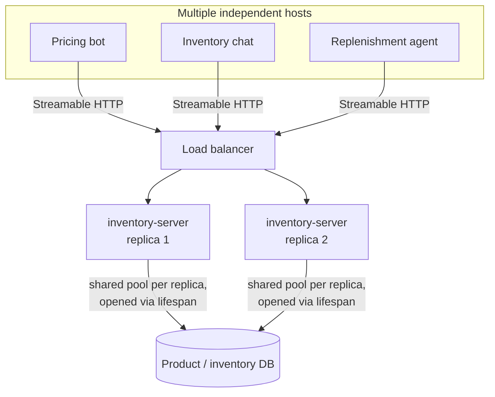
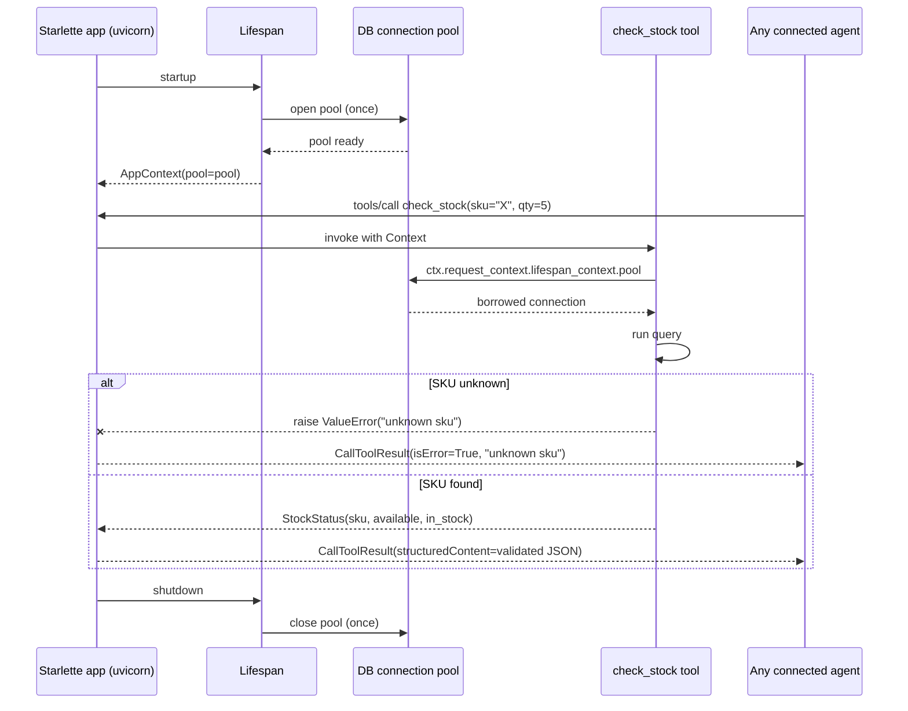

# Pattern 3: MCP Server

[← Back to index](./README.md)

## 1. Introduce the pattern

The **MCP Server** is the piece that *owns* a capability — a database, an API, a business rule —
and exposes it safely to any number of hosts. Pattern 1 and 2 used simple servers to show the
protocol; this pattern is about what changes when that server has to survive contact with
production: concurrent requests from many agents at once, a database connection pool that must be
opened once and shared (not once per request), horizontal scaling behind a load balancer, and
errors that shouldn't crash the process or leak stack traces to the model.

`FastMCP` (the high-level API used throughout this series) gives you four production levers:

- **Lifespan management** — set up expensive resources (DB pools, HTTP clients) once at startup,
  tear them down once at shutdown, and hand them to every tool call via `Context`.
- **Structured output** — declare a Pydantic model or `TypedDict` as a tool's return type and get
  automatic schema generation *and* validation, instead of hoping the tool always returns the
  right shape.
- **Transport choice** — stdio for a subprocess launched by one host; **stateless Streamable
  HTTP** for a shared service that needs to scale to N replicas behind a load balancer.
- **Clean error handling** — raise a normal Python exception in a tool and FastMCP turns it into a
  proper MCP tool error the model can reason about, instead of an unhandled 500.



## 2. The problem it solves

A naive MCP server — open a DB connection inside every `@mcp.tool()` function, return whatever
dict the query happens to produce, run with the default transport — works fine in a demo and
falls over in production in three specific ways:

1. **Connection churn**: opening a new DB connection per tool call is slow and will exhaust the
   database's connection limit under real concurrency.
2. **Unvalidated output**: if a query returns an unexpected shape (a `None` price, a missing
   field), the model receives garbage silently instead of a clear, catchable error.
3. **No horizontal scaling story**: stdio only works for a server launched by exactly one host
   process; a server used by *many* independent agents needs to be a shared, stateless network
   service that can run as multiple replicas behind a load balancer.

The lifespan API, structured output, and stateless Streamable HTTP transport exist specifically to
close these three gaps.

## 3. A realistic production scenario

**Scenario: Inventory & Pricing MCP Server** at an e-commerce platform. Three separate teams'
agents need the same product data: a pricing bot for customer chat, an internal inventory
assistant, and an automated replenishment agent. Rather than each team querying the product
database directly (and each re-implementing price-formatting and stock-threshold logic), the
platform team ships one MCP server:

- `get_price(sku)` — returns a validated, structured price quote.
- `check_stock(sku, requested_qty)` — returns whether the requested quantity is available, and
  raises a clear error for an unknown SKU rather than returning ambiguous data.

Because three *independent* hosts depend on it, it must run as a shared, stateless HTTP service
that can be scaled to multiple replicas — not a subprocess owned by any one of them.

## 4. Architecture / flow diagram



## 5. The complete request-to-response flow

1. **Process startup.** `uvicorn` starts the Starlette app that wraps the FastMCP server. The
   `lifespan` async context manager runs once: it opens the DB connection pool and packages it
   into a typed `AppContext`.
2. **Client connects.** An agent host (any of the three consumers) opens a Streamable HTTP session
   to the server and lists its tools/discovers schemas — identical to Patterns 1 and 2, just over
   a shared network endpoint instead of a subprocess.
3. **Tool call arrives.** `check_stock` is invoked with validated input (FastMCP already checked
   the arguments against the tool's input schema before your function runs).
4. **Resource access via Context.** The tool function receives a `Context` parameter and reaches
   into `ctx.request_context.lifespan_context.pool` — the *same* pool opened at startup, not a new
   connection.
5. **Business logic + validation.** The query runs; the result is constructed as a Pydantic model
   (`StockStatus`). If the SKU doesn't exist, the function raises a plain `ValueError`.
6. **Error or success translation.** FastMCP catches the `ValueError` and returns a proper MCP
   tool error (`isError=True` with a readable message) rather than crashing the request; on
   success, the Pydantic model is serialized and validated against the auto-generated output
   schema before being sent back.
7. **Scaling.** Because `stateless_http=True`, any replica behind the load balancer can serve any
   request — there's no server-side session affinity to worry about, so you scale by adding more
   uvicorn workers/replicas.
8. **Shutdown.** On process exit, the lifespan's `finally` block closes the pool cleanly.

## 6. Why this pattern is appropriate

- **Correctness under load**: a shared, pooled connection handles concurrent tool calls from three
  different agents safely; per-call connections would not.
- **Fail loud, not silent**: raising `ValueError` for an unknown SKU gives the model (and the
  end user, transitively) a clear, actionable error instead of a stock status for a product that
  doesn't exist.
- **Scale-out ready**: `stateless_http=True` + `json_response=True` is the documented, recommended
  configuration for multi-node Streamable HTTP deployments — no sticky sessions required.
- **One server, many consumers**: the pricing bot, inventory chat, and replenishment agent all get
  identical, tested business logic instead of three slightly-different reimplementations.

Trade-off: a stateless server can't hold per-client conversational state between calls (that's
fine here — pricing and stock lookups are naturally stateless). A server that *needs* session
affinity (e.g. multi-step server-side workflows) would instead run stateful HTTP or add its own
external state store — a decision worth making explicitly, not by default.

## 7. Production-quality implementation

### 7.1 Install dependencies

```bash
pip install "mcp[cli]>=1.28,<2" "starlette>=0.47" "uvicorn>=0.34"
```

### 7.2 The server — `inventory_pricing_server.py`

```python
"""
inventory_pricing_server.py

Production-style MCP server: lifespan-managed connection pool, structured
(Pydantic-validated) tool output, clean error handling, and stateless
Streamable HTTP for horizontal scaling behind a load balancer.

Run for local development:
    python inventory_pricing_server.py
Serves on http://localhost:8000/mcp

Run for production (multiple workers):
    uvicorn inventory_pricing_server:app --host 0.0.0.0 --port 8000 --workers 4
"""

from __future__ import annotations

import asyncio
import contextlib
import logging
from collections.abc import AsyncIterator
from dataclasses import dataclass

from pydantic import BaseModel, Field
from starlette.applications import Starlette
from starlette.middleware.cors import CORSMiddleware
from starlette.routing import Mount

from mcp.server.fastmcp import Context, FastMCP
from mcp.server.session import ServerSession

logging.basicConfig(level=logging.INFO)
logger = logging.getLogger("inventory_pricing_server")


# --------------------------------------------------------------------------
# A minimal async connection-pool stand-in. In production this would be an
# asyncpg.Pool, a SQLAlchemy async engine, etc. — the key property is that
# it's expensive to create and must be opened exactly once.
# --------------------------------------------------------------------------
class ProductDBPool:
    """Simulated DB pool with an in-memory product/stock catalogue."""

    _CATALOGUE: dict[str, dict[str, float | int]] = {
        "SKU-100": {"price_usd": 24.99, "stock": 120},
        "SKU-200": {"price_usd": 149.00, "stock": 3},
    }

    @classmethod
    async def connect(cls) -> "ProductDBPool":
        await asyncio.sleep(0)  # simulate async connect
        logger.info("Product DB pool opened")
        return cls()

    async def close(self) -> None:
        logger.info("Product DB pool closed")

    async def fetch_product(self, sku: str) -> dict[str, float | int] | None:
        await asyncio.sleep(0)  # simulate async query
        return self._CATALOGUE.get(sku)


@dataclass
class AppContext:
    """Typed resources available to every tool call via Context."""

    pool: ProductDBPool


@contextlib.asynccontextmanager
async def app_lifespan(server: FastMCP) -> AsyncIterator[AppContext]:
    """Open shared resources once at startup, close them once at shutdown."""
    pool = await ProductDBPool.connect()
    try:
        yield AppContext(pool=pool)
    finally:
        await pool.close()


mcp = FastMCP(
    name="inventory-pricing-server",
    instructions="Provides authoritative product pricing and stock levels.",
    lifespan=app_lifespan,
    # Recommended production config for Streamable HTTP: no server-side
    # session affinity needed, so any replica can serve any request.
    stateless_http=True,
    json_response=True,
)


class PriceQuote(BaseModel):
    """Structured, validated response for a price lookup."""

    sku: str
    price_usd: float = Field(ge=0, description="Current price in US dollars")


class StockStatus(BaseModel):
    """Structured, validated response for a stock check."""

    sku: str
    requested_qty: int
    available_qty: int
    in_stock: bool


@mcp.tool()
async def get_price(sku: str, ctx: Context[ServerSession, AppContext]) -> PriceQuote:
    """Get the current price for a product SKU."""
    pool = ctx.request_context.lifespan_context.pool
    product = await pool.fetch_product(sku)
    if product is None:
        raise ValueError(f"Unknown SKU '{sku}'")
    return PriceQuote(sku=sku, price_usd=float(product["price_usd"]))


@mcp.tool()
async def check_stock(
    sku: str, requested_qty: int, ctx: Context[ServerSession, AppContext]
) -> StockStatus:
    """Check whether the requested quantity of a SKU is currently in stock."""
    if requested_qty <= 0:
        raise ValueError("requested_qty must be a positive integer")

    pool = ctx.request_context.lifespan_context.pool
    product = await pool.fetch_product(sku)
    if product is None:
        raise ValueError(f"Unknown SKU '{sku}'")

    available = int(product["stock"])
    return StockStatus(
        sku=sku,
        requested_qty=requested_qty,
        available_qty=available,
        in_stock=available >= requested_qty,
    )


# --------------------------------------------------------------------------
# Mount on a Starlette app with CORS enabled, so an internal browser-based
# admin dashboard can also talk to this server directly (see Pattern 2's
# note on the Mcp-Session-Id header for stateful deployments; not needed
# here since we're stateless).
# --------------------------------------------------------------------------
@contextlib.asynccontextmanager
async def starlette_lifespan(_app: Starlette) -> AsyncIterator[None]:
    async with mcp.session_manager.run():
        yield


app = Starlette(
    routes=[Mount("/", app=mcp.streamable_http_app())],
    lifespan=starlette_lifespan,
)
app = CORSMiddleware(
    app,
    allow_origins=["https://admin.internal.example.com"],
    allow_methods=["GET", "POST", "DELETE"],
    expose_headers=["Mcp-Session-Id"],
)


if __name__ == "__main__":
    mcp.run(transport="streamable-http")
```

### 7.3 A quick smoke-test client — `check_server.py`

```python
"""
check_server.py

Minimal client to exercise both the success and error paths of the
inventory/pricing server. Run inventory_pricing_server.py first.
"""

from __future__ import annotations

import asyncio

from langchain_mcp_adapters.client import MultiServerMCPClient


async def main() -> None:
    client = MultiServerMCPClient(
        {"inventory": {"url": "http://localhost:8000/mcp", "transport": "streamable_http"}}
    )
    tools = await client.get_tools(server_name="inventory")
    by_name = {t.name: t for t in tools}

    price = await by_name["get_price"].ainvoke({"sku": "SKU-100"})
    print("get_price(SKU-100) ->", price)

    stock = await by_name["check_stock"].ainvoke({"sku": "SKU-200", "requested_qty": 10})
    print("check_stock(SKU-200, 10) ->", stock)

    try:
        await by_name["get_price"].ainvoke({"sku": "SKU-999"})
    except Exception as exc:
        print("get_price(SKU-999) raised cleanly ->", exc)


if __name__ == "__main__":
    asyncio.run(main())
```

### 7.4 What happens when you run it

- `get_price("SKU-100")` returns a validated `PriceQuote` — if the underlying catalogue ever
  returned a malformed record (e.g. a string instead of a float), Pydantic validation would raise
  *before* the bad data ever reached the model.
- `check_stock("SKU-200", 10)` returns `in_stock=False` (only 3 available) — structured, so the
  calling agent can branch on `in_stock` directly instead of parsing prose.
- `get_price("SKU-999")` raises a clean `ValueError` server-side, which FastMCP turns into an MCP
  tool error the client-side call surfaces as a normal Python exception — no stack trace leaks to
  the model, and the agent can catch it and explain to the user that the SKU doesn't exist.
- Because the pool is opened once in `app_lifespan`, all three calls above reuse the same
  simulated connection — in a real deployment, running `uvicorn ... --workers 4` gives you four
  replicas, each with its own pool, all serviceable by the load balancer.

Next up: **MCP Resources** — a deep dive into the data-exposure side of MCP servers, including
resource templates, subscriptions, and when to use a resource instead of a tool.

---

[← Back to index](./README.md)
