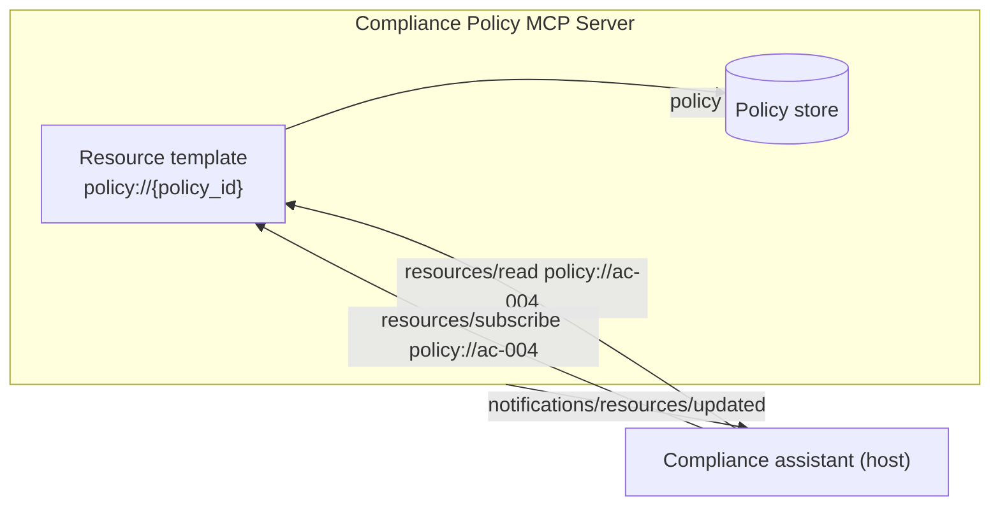
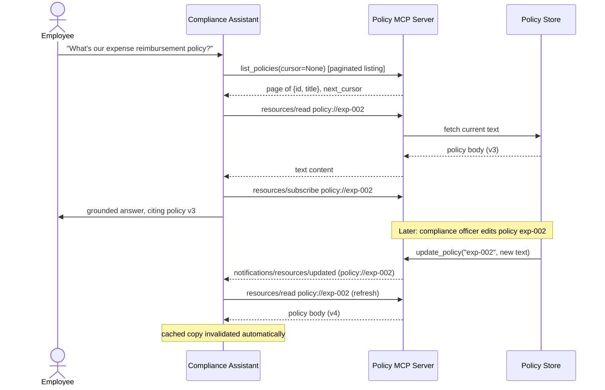

# Pattern 4: MCP Resources

[← Back to index](./README.md)

## 1. Introduce the pattern

**Resources** are how an MCP server exposes *data* — think of them as the GET endpoints of MCP.
They're identified by a URI (`policy://ac-004`, `file://documents/report.pdf`,
`config://settings`), they return content (text, JSON, binary), and — critically — they are not
supposed to have side effects. Reading a resource twice should be safe.

Resources come in two shapes:

- **Static resources** — a fixed URI, like `config://settings`.
- **Resource templates** — a parameterized URI pattern, like `policy://{policy_id}`, which the
  server resolves per request. This is the shape you'll use most in production, since real data
  is rarely a fixed, single document.

The key distinction that matters for design decisions: **resources are application-controlled,
tools are model-controlled.** The *host application* decides when to load a resource into context
(e.g. "the user opened this document, so include it"); the *LLM* decides when to call a tool. Get
this distinction right and you avoid two common mistakes: turning read-only data into a tool call
the model has to "remember" to make, or turning an action with side effects into something that
looks like safe, cacheable data.



## 2. The problem it solves

If every piece of contextual data has to be fetched through a *tool*, you inherit tool-calling's
downsides for something that's really just "give me this document":

- The model has to correctly decide to call the tool, with the right arguments, every single
  time — an unnecessary source of failure for data that's often known up front (e.g. "the policy
  the user is currently viewing").
- There's no standard way to say "notify me if this changes," so the host either polls
  constantly or serves stale data.
- Large data sets (hundreds of policies) need a first-class way to be listed and paginated, not
  crammed into a single tool call's response.

MCP resources solve all three: the host can read a resource directly (no model round-trip needed),
subscribe to be notified when it changes, and list resources with proper pagination.

## 3. A realistic production scenario

**Scenario: Compliance Policy Library.** A compliance team maintains ~200 internal policy
documents. An internal assistant answers employee questions ("what's our expense policy?") and
must **always ground its answer in the current version of the policy** — policies get revised, and
a stale answer is a real business risk (e.g. citing an outdated data-retention rule).

Requirements:

- Fetch a specific policy's full text by ID (**resource template**).
- List policies in pages, since there are too many to return at once (**pagination**).
- Be notified immediately if a policy the assistant is actively using gets revised, so it never
  answers from a stale cached copy (**subscriptions**).

## 4. Architecture / flow diagram



## 5. The complete request-to-response flow

1. **Discovery.** The host calls `list_resource_templates` to learn `policy://{policy_id}`
   exists, and (in this design) a `list_policies` tool for a paginated index — see the note below
   on why the index itself is a tool, not a resource list, in this scenario.
2. **Paginated listing.** `list_policies` returns a `page_size`-sized slice plus an opaque
   `next_cursor`; the host keeps calling with the returned cursor until `next_cursor` is `None`.
3. **Resolving the template.** Once the employee's question is matched to a policy ID, the host
   issues `resources/read` for `policy://exp-002`. The server resolves the `{policy_id}` template
   variable against its store and returns the current text.
4. **Subscribing.** Because this policy is now "in play" for the conversation, the host subscribes
   to it (`resources/subscribe`). The server tracks this URI as one it should notify about.
5. **Live update.** Later, a compliance officer edits the policy through a separate admin tool.
   The server-side `update_policy` handler writes the new version and calls
   `ctx.session.send_resource_updated(uri)`.
6. **Notification → refresh.** The host receives the `notifications/resources/updated` message,
   invalidates any cached copy, and re-reads the resource before using it again — guaranteeing the
   assistant never answers from stale policy text.
7. **Unsubscribe.** When the conversation ends, the host unsubscribes (or the session simply
   closes), and the server stops tracking it.

**Why is `list_policies` a tool here, not a resource list?** MCP's own `resources/list` is for
enumerating a server's own static/template resources for discovery, not for arbitrary paginated
business queries. For "give me page 2 of policies matching no particular filter," a plain tool
with your own cursor semantics is simpler and more flexible (you can add filtering, sorting, etc.
without fighting the protocol's resource-listing shape) — reserve `resources/list` for genuinely
enumerable, discoverable resources.

## 6. Why this pattern is appropriate

- **No model round-trip for "give me the doc"**: once the host knows which policy is relevant, it
  reads the resource directly — faster and more reliable than hoping the model calls a
  `get_policy` tool with the exact right ID every time.
- **Freshness guarantee**: subscriptions turn "might be stale" into "actively invalidated,"
  which matters a great deal for compliance-grade answers.
- **Natural caching boundary**: because resources are meant to be side-effect-free, the host is
  free to cache reads aggressively between subscription notifications — something you *can't*
  safely do with tool calls in general.

Trade-off: subscriptions add server-side bookkeeping (tracking who's subscribed to what) and
require the server to remain connected to push notifications — this only pays off for data that
genuinely changes during a session. For data that's read once and never revisited, a plain
resource read (or even a tool) is simpler and perfectly fine.

## 7. Production-quality implementation

### 7.1 Install dependencies

```bash
pip install "mcp[cli]>=1.28,<2"
```

### 7.2 The server — `policy_server.py`

```python
"""
policy_server.py

Compliance policy library MCP server: a resource template for fetching a
policy's current text, a paginated tool for listing policies, and live
resource-update notifications when a policy is revised.

Run:
    python policy_server.py
"""

from __future__ import annotations

import logging
from dataclasses import dataclass, field

from pydantic import BaseModel

from mcp.server.fastmcp import Context, FastMCP
from mcp.server.session import ServerSession

logging.basicConfig(level=logging.INFO)
logger = logging.getLogger("policy_server")


@dataclass
class Policy:
    id: str
    title: str
    body: str
    version: int = 1


# --------------------------------------------------------------------------
# In-memory policy store. Ordering is stable so pagination cursors (plain
# integer offsets here) stay valid between calls.
# --------------------------------------------------------------------------
_POLICIES: dict[str, Policy] = {
    f"pol-{i:03d}": Policy(id=f"pol-{i:03d}", title=f"Policy {i:03d}", body=f"Body of policy {i:03d}, v1.")
    for i in range(1, 6)
}
_POLICIES["exp-002"] = Policy(
    id="exp-002",
    title="Expense Reimbursement Policy",
    body="Employees may expense meals up to $50/day while travelling. Receipts required over $25.",
    version=3,
)
_POLICY_ORDER: list[str] = list(_POLICIES.keys())


mcp = FastMCP(
    name="policy-server",
    instructions=(
        "Provides internal compliance policies. Use list_policies to find a "
        "policy id, then read the policy://{id} resource for its current text. "
        "Subscribe to a policy resource to be notified if it's revised."
    ),
)


class PolicyPage(BaseModel):
    items: list[dict[str, str]]
    next_cursor: str | None


@mcp.tool()
def list_policies(cursor: str | None = None, page_size: int = 2) -> PolicyPage:
    """List policies with id and title, paginated. Pass the returned next_cursor to get more."""
    start = int(cursor) if cursor else 0
    end = start + page_size
    page_ids = _POLICY_ORDER[start:end]
    items = [{"id": pid, "title": _POLICIES[pid].title} for pid in page_ids]
    next_cursor = str(end) if end < len(_POLICY_ORDER) else None
    return PolicyPage(items=items, next_cursor=next_cursor)


@mcp.resource("policy://{policy_id}")
def read_policy(policy_id: str) -> str:
    """Read the current full text of a policy by id."""
    policy = _POLICIES.get(policy_id)
    if policy is None:
        return f"No policy found with id '{policy_id}'."
    return f"# {policy.title} (v{policy.version})\n\n{policy.body}"


@mcp.tool()
async def update_policy(
    policy_id: str, new_body: str, ctx: Context[ServerSession, None]
) -> dict[str, str]:
    """Admin action: revise a policy's text and notify any subscribers.

    In production this would be gated by an authorization check
    (see Pattern 11: MCP Authorization) — only compliance officers should
    be able to call this.
    """
    policy = _POLICIES.get(policy_id)
    if policy is None:
        raise ValueError(f"Unknown policy id '{policy_id}'")

    policy.body = new_body
    policy.version += 1

    # Tell any client that subscribed to this resource that it changed, so
    # they can invalidate caches and re-read before their next answer.
    await ctx.session.send_resource_updated(f"policy://{policy_id}")  # type: ignore[arg-type]
    logger.info("policy '%s' updated to v%d, subscribers notified", policy_id, policy.version)

    return {"status": "updated", "policy_id": policy_id, "version": str(policy.version)}


if __name__ == "__main__":
    mcp.run(transport="stdio")
```

### 7.3 A host that lists, reads, subscribes, and reacts — `compliance_client.py`

```python
"""
compliance_client.py

Demonstrates the full resource lifecycle: paginated listing, reading a
resource template, subscribing to it, and reacting to a live update
notification by re-reading before answering again.
"""

from __future__ import annotations

import asyncio

from mcp import ClientSession, StdioServerParameters, types
from mcp.client.stdio import stdio_client
from pydantic import AnyUrl


async def list_all_policies(session: ClientSession) -> list[dict[str, str]]:
    """Walk every page of list_policies until next_cursor is exhausted."""
    all_items: list[dict[str, str]] = []
    cursor: str | None = None
    while True:
        result = await session.call_tool("list_policies", arguments={"cursor": cursor})
        page = result.structuredContent
        all_items.extend(page["items"])
        cursor = page["next_cursor"]
        if cursor is None:
            break
    return all_items


async def main() -> None:
    server_params = StdioServerParameters(command="python", args=["policy_server.py"])

    async def on_resource_updated(uri: AnyUrl) -> None:
        print(f"\n[notification] resource changed: {uri} — will re-read before next answer")

    async with stdio_client(server_params) as (read, write):
        async with ClientSession(
            read,
            write,
            message_handler=None,  # see note below
        ) as session:
            await session.initialize()

            policies = await list_all_policies(session)
            print("All policies:", [p["id"] for p in policies])

            uri = AnyUrl("policy://exp-002")
            content = await session.read_resource(uri)
            text_block = content.contents[0]
            assert isinstance(text_block, types.TextResourceContents)
            print("\nCurrent expense policy:\n", text_block.text)

            await session.subscribe_resource(uri)
            print("\nSubscribed to policy://exp-002 for live updates.")

            # Simulate a compliance officer revising the policy elsewhere.
            await session.call_tool(
                "update_policy",
                arguments={
                    "policy_id": "exp-002",
                    "new_body": "Employees may expense meals up to $75/day while travelling.",
                },
            )

            # In a full application, notifications arrive via the session's
            # message stream / a registered notification handler and would
            # trigger the re-read below automatically. Here we re-read
            # explicitly to show the refreshed content:
            refreshed = await session.read_resource(uri)
            refreshed_text = refreshed.contents[0]
            assert isinstance(refreshed_text, types.TextResourceContents)
            print("\nRefreshed expense policy:\n", refreshed_text.text)


if __name__ == "__main__":
    asyncio.run(main())
```

> **Note on notification handling:** production hosts register a notification handler on the
> `ClientSession` to react to `notifications/resources/updated` asynchronously (e.g. invalidate a
> cache entry, or re-run RAG retrieval) rather than re-reading synchronously in the main flow as
> shown above for clarity. The mechanism is the same one you'd use for `send_resource_list_changed`
> and `send_tool_list_changed` from Pattern 3.

### 7.4 What happens when you run it

1. `list_all_policies` walks two pages at a time (`page_size=2`) until every policy has been
   collected — the same cursor-based pattern that scales to a real 200-policy catalogue without
   ever sending them all in one response.
2. Reading `policy://exp-002` returns the current v3 text.
3. After `update_policy` bumps it to v4 and calls `send_resource_updated`, re-reading the same URI
   returns the new $75/day text — proving the host is never stuck with a stale cached answer for a
   policy it's actively tracking.

Next up: **MCP Tools** — a deep dive on the model-controlled action side: input/output schemas,
side-effect annotations, progress reporting for long-running tools, and safe error design.

---

[← Back to index](./README.md)
