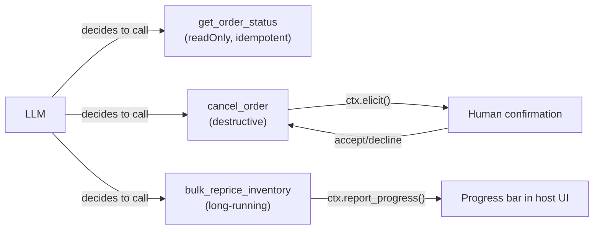
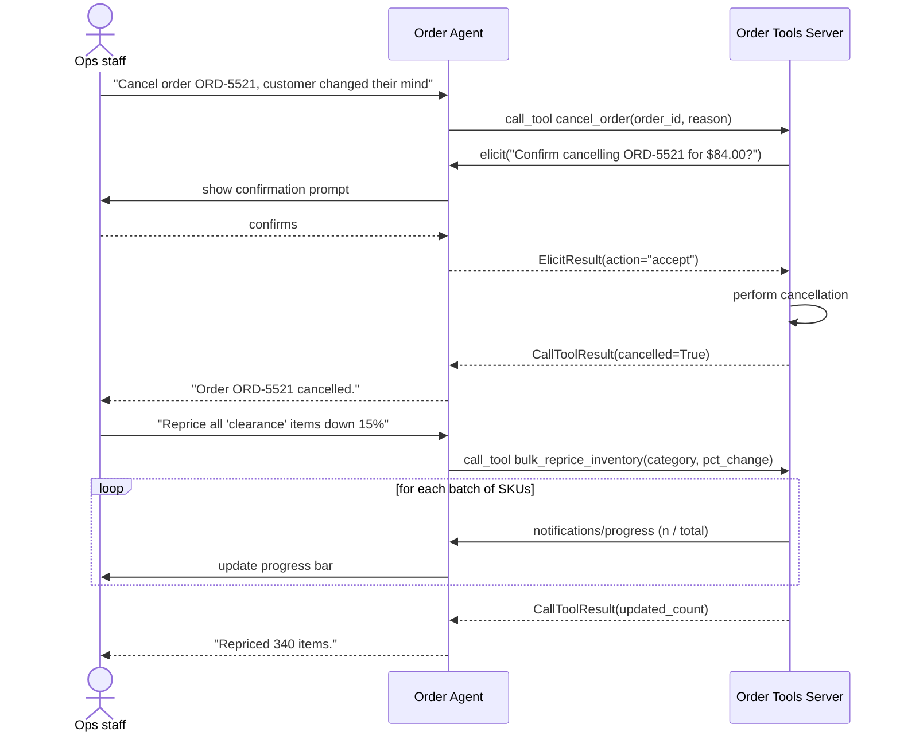

# Pattern 5: MCP Tools

[← Back to index](./README.md)

## 1. Introduce the pattern

**Tools** are how a server exposes *actions* — model-controlled, expected to do work, and
sometimes to have side effects. Where a resource is "give me this data," a tool is "do this
thing" (or "compute this thing"). The whole contract the model relies on to use a tool safely and
correctly comes from three places:

- **The function signature and docstring** — argument names, types, and descriptions become the
  tool's JSON Schema. This *is* the model's only knowledge of how to call it.
- **Annotations** — `readOnlyHint`, `destructiveHint`, `idempotentHint`, `openWorldHint` tell the
  *host* (not the model) how much friction to add: should this run automatically, or should a
  human confirm first?
- **Progress and elicitation** — for anything slow or risky, the `Context` object lets a tool
  report incremental progress or pause to ask the user a direct question before proceeding.

Getting tool design right is mostly about being honest in these three places: don't annotate a
destructive action as read-only, don't leave a five-minute tool call silent, and don't accept an
ambiguous string argument where a typed one would do.



## 2. The problem it solves

Handing an LLM a set of Python functions with no further metadata creates three real production
risks:

1. **Destructive actions fire without a human in the loop.** A model that's "pretty sure" the user
   wants an order cancelled shouldn't be able to cancel it unilaterally — but nothing stops that
   by default.
2. **Long operations look hung.** A bulk repricing job that takes 45 seconds with no feedback
   looks identical, from the UI's perspective, to a crashed connection.
3. **Ambiguous inputs cause silent misuse.** A tool that accepts `order_id: str` with no
   description invites the model to pass a customer name, an order number in the wrong format, or
   a guess.

Annotations, elicitation, and progress reporting are MCP's answers to each of these,
respectively.

## 3. A realistic production scenario

**Scenario: Order Management tools** for a retail operations agent used by customer-support
staff. Three tools, three different risk profiles:

- `get_order_status(order_id)` — **read-only, idempotent**. Safe to call freely, safe to retry,
  safe to call speculatively.
- `cancel_order(order_id, reason)` — **destructive, not idempotent**. Cancelling twice isn't the
  same as cancelling once (the second call should just report "already cancelled," not attempt it
  again) and it has a real business consequence. This tool must confirm with a human before
  acting.
- `bulk_reprice_inventory(category, pct_change)` — **long-running**. Touches hundreds of SKUs and
  should stream progress so the ops person watching doesn't think the agent has stalled.

## 4. Architecture / flow diagram



## 5. The complete request-to-response flow

1. **Discovery with annotations.** `tools/list` returns each tool's schema *and* its annotations.
   A well-behaved host uses `readOnlyHint`/`idempotentHint` to decide `get_order_status` can be
   called freely, while `destructiveHint` on `cancel_order` flags it for extra scrutiny.
2. **Read-only call.** `get_order_status` executes and returns immediately — no confirmation
   needed, safe to call even speculatively while drafting a response.
3. **Destructive call reaches a confirmation gate.** Inside `cancel_order`, before mutating
   anything, the tool calls `ctx.elicit(message, schema)`. This suspends the tool call and sends
   an elicitation request back to the client.
4. **Human-in-the-loop.** The host surfaces the elicitation to the ops person (in this series,
   via a client-side callback) and waits for `accept`, `decline`, or `cancel`.
5. **Conditional execution.** Only on `accept` does the tool proceed to actually cancel the order;
   `decline`/`cancel` short-circuit with a clear, non-destructive result.
6. **Long-running call reports progress.** `bulk_reprice_inventory` processes SKUs in batches,
   calling `await ctx.report_progress(progress, total, message)` after each batch so the host can
   render a live progress indicator instead of a silent wait.
7. **Final result.** Once complete, the tool returns a structured summary (`updated_count`), and
   the model uses it to tell the ops person what happened.

## 6. Why this pattern is appropriate

- **Annotations let the host encode policy without touching the model.** "Always confirm
  destructive tools" is a host-side rule that works for *any* tool correctly annotated, present or
  future — you don't have to teach the model a new rule per tool.
- **Elicitation keeps humans in control of consequential actions** without forcing every tool call
  through a slower, always-on approval queue (Pattern 12: Human Approval Workflow covers the
  heavier, workflow-level version of this).
- **Progress reporting is cheap and high-value**: a few extra `await ctx.report_progress(...)`
  calls turn a black-box wait into a legible operation.

Trade-off: elicitation requires the client to implement a synchronous "ask the human" callback,
which doesn't fit every host (e.g. a fully autonomous batch pipeline has no human to ask). For
those cases, gate destructive tools with a different mechanism — a pre-approved allow-list, an
external approval workflow, or simply not exposing the tool at all.

## 7. Production-quality implementation

### 7.1 Install dependencies

```bash
pip install "mcp[cli]>=1.28,<2"
```

### 7.2 The server — `order_tools_server.py`

```python
"""
order_tools_server.py

Order management tools with honest annotations, a human-confirmation gate
on the destructive action, and progress reporting on the long-running one.

Run:
    python order_tools_server.py
"""

from __future__ import annotations

import asyncio
import logging
from dataclasses import dataclass

from pydantic import BaseModel, Field

from mcp.server.fastmcp import Context, FastMCP
from mcp.server.session import ServerSession
from mcp.types import ToolAnnotations

logging.basicConfig(level=logging.INFO)
logger = logging.getLogger("order_tools_server")

mcp = FastMCP(name="order-tools-server")


# --------------------------------------------------------------------------
# Simulated order + inventory store
# --------------------------------------------------------------------------
@dataclass
class Order:
    id: str
    total_usd: float
    status: str  # "placed" | "cancelled"


_ORDERS: dict[str, Order] = {
    "ORD-5521": Order(id="ORD-5521", total_usd=84.00, status="placed"),
}
_CLEARANCE_SKUS: dict[str, float] = {f"CLR-{i:03d}": 20.0 + i for i in range(1, 21)}


class OrderStatus(BaseModel):
    order_id: str
    status: str
    total_usd: float


@mcp.tool(
    annotations=ToolAnnotations(
        title="Get order status",
        readOnlyHint=True,
        idempotentHint=True,
        openWorldHint=False,
    )
)
def get_order_status(order_id: str) -> OrderStatus:
    """Look up an order's current status and total. Safe to call at any time."""
    order = _ORDERS.get(order_id)
    if order is None:
        raise ValueError(f"Unknown order id '{order_id}'")
    return OrderStatus(order_id=order.id, status=order.status, total_usd=order.total_usd)


class CancelConfirmation(BaseModel):
    confirm: bool = Field(description="Confirm cancelling this order?")


@mcp.tool(
    annotations=ToolAnnotations(
        title="Cancel order",
        readOnlyHint=False,
        destructiveHint=True,
        idempotentHint=False,
        openWorldHint=False,
    )
)
async def cancel_order(
    order_id: str, reason: str, ctx: Context[ServerSession, None]
) -> dict[str, str]:
    """Cancel an order. Requires human confirmation before it takes effect.

    Args:
        order_id: The order to cancel, e.g. ORD-5521.
        reason: Why the order is being cancelled (recorded for audit).
    """
    order = _ORDERS.get(order_id)
    if order is None:
        raise ValueError(f"Unknown order id '{order_id}'")

    if order.status == "cancelled":
        # Idempotency for the *outcome*, even though the action itself isn't
        # idempotent: calling this twice reports the existing state instead
        # of erroring or double-cancelling.
        return {"status": "already_cancelled", "order_id": order_id}

    result = await ctx.elicit(
        message=f"Confirm cancelling {order_id} (${order.total_usd:.2f})? Reason: {reason}",
        schema=CancelConfirmation,
    )

    if result.action != "accept" or not (result.data and result.data.confirm):
        return {"status": "not_cancelled", "order_id": order_id, "reason": "declined by user"}

    order.status = "cancelled"
    logger.info("order %s cancelled: %s", order_id, reason)
    return {"status": "cancelled", "order_id": order_id}


class RepriceResult(BaseModel):
    category: str
    updated_count: int


@mcp.tool(
    annotations=ToolAnnotations(
        title="Bulk reprice inventory",
        readOnlyHint=False,
        destructiveHint=False,
        idempotentHint=True,
        openWorldHint=False,
    )
)
async def bulk_reprice_inventory(
    category: str, pct_change: float, ctx: Context[ServerSession, None]
) -> RepriceResult:
    """Apply a percentage price change to every SKU in a category, reporting progress."""
    if category != "clearance":
        raise ValueError("Only the 'clearance' category is supported in this example")

    skus = list(_CLEARANCE_SKUS.items())
    total = len(skus)
    batch_size = 5

    await ctx.info(f"Repricing {total} clearance SKUs by {pct_change:+.1f}%")

    for start in range(0, total, batch_size):
        batch = skus[start : start + batch_size]
        for sku, price in batch:
            _CLEARANCE_SKUS[sku] = round(price * (1 + pct_change / 100), 2)
        done = min(start + batch_size, total)
        await ctx.report_progress(
            progress=done, total=total, message=f"Repriced {done}/{total} SKUs"
        )
        await asyncio.sleep(0)  # yield control; simulates real per-batch I/O

    return RepriceResult(category=category, updated_count=total)


if __name__ == "__main__":
    mcp.run(transport="stdio")
```

### 7.3 A host that confirms and shows progress — `order_agent.py`

```python
"""
order_agent.py

Demonstrates a real elicitation callback (a stand-in for a UI confirmation
dialog) and a progress callback wired up to plain print statements, so you
can see both flows end to end.
"""

from __future__ import annotations

import asyncio

from mcp import ClientSession, StdioServerParameters, types
from mcp.client.stdio import stdio_client
from mcp.shared.context import RequestContext


async def handle_elicitation(
    context: RequestContext[ClientSession, None], params: types.ElicitRequestParams
) -> types.ElicitResult:
    """Stand-in for a real confirmation UI: auto-confirms after showing the prompt."""
    print(f"\n[confirmation required] {params.message}")
    print("  -> auto-confirming for this demo (a real UI would ask the ops person)")
    return types.ElicitResult(action="accept", content={"confirm": True})


async def on_progress(progress: float, total: float | None, message: str | None) -> None:
    pct = f"{(progress / total * 100):.0f}%" if total else str(progress)
    print(f"  [progress] {pct} — {message or ''}")


async def main() -> None:
    server_params = StdioServerParameters(command="python", args=["order_tools_server.py"])

    async with stdio_client(server_params) as (read, write):
        async with ClientSession(
            read, write, elicitation_callback=handle_elicitation
        ) as session:
            await session.initialize()

            status = await session.call_tool("get_order_status", {"order_id": "ORD-5521"})
            print("Order status:", status.structuredContent)

            cancel_result = await session.call_tool(
                "cancel_order",
                {"order_id": "ORD-5521", "reason": "customer changed their mind"},
                progress_callback=on_progress,
            )
            print("Cancel result:", cancel_result.structuredContent)

            reprice_result = await session.call_tool(
                "bulk_reprice_inventory",
                {"category": "clearance", "pct_change": -15.0},
                progress_callback=on_progress,
            )
            print("Reprice result:", reprice_result.structuredContent)


if __name__ == "__main__":
    asyncio.run(main())
```

### 7.4 What happens when you run it

1. `get_order_status` returns instantly — annotated `readOnlyHint=True`, so a production host
   could call it without any confirmation UI at all.
2. `cancel_order` pauses mid-call and sends an elicitation request; the demo callback
   auto-accepts (a real UI would render an actual confirmation dialog and wait for the ops
   person), and only then does the order flip to `"cancelled"`.
3. Calling `cancel_order` on the same order again returns `"already_cancelled"` immediately — no
   second elicitation, because the tool made the *outcome* idempotent even though the underlying
   action (cancelling) conceptually isn't something you'd want to repeat.
4. `bulk_reprice_inventory` prints incremental `[progress] 25% / 50% / ...` lines as it works
   through clearance SKUs in batches of five, instead of going silent for the whole call.

Next up: **MCP Prompts** — reusable, user-controlled templates, and how they differ from just
hard-coding a system prompt in your host.

---

[← Back to index](./README.md)
