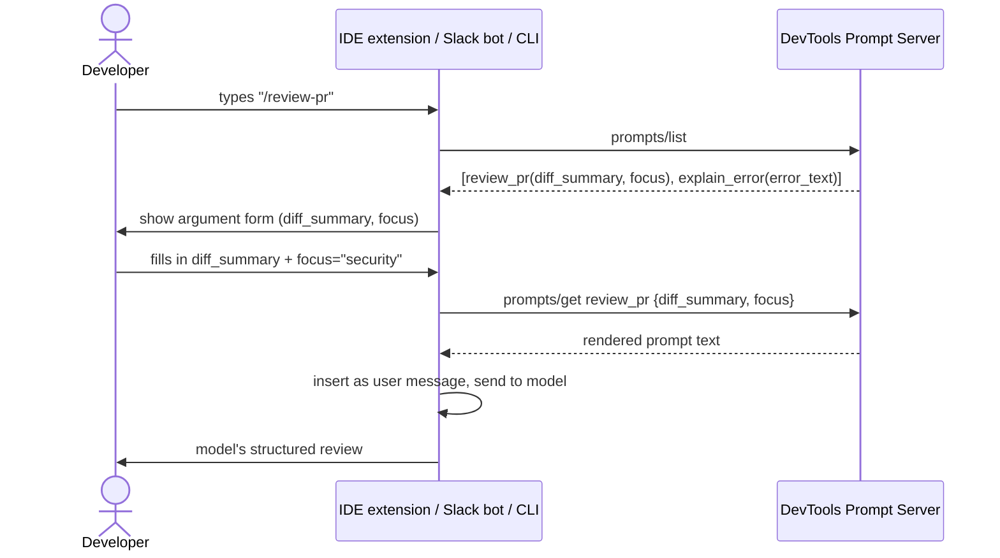

# Pattern 6: MCP Prompts

[← Back to index](./README.md)

## 1. Introduce the pattern

**Prompts** are reusable, **user-controlled** templates — the "slash commands" of MCP. Where a
tool is something the *model* decides to invoke and a resource is something the *host* loads
automatically, a prompt is something a *person* explicitly picks: `/review-pr`, `/explain-error`,
`/write-release-notes`. The server owns the template text (and can improve it centrally); the host
just presents the available prompts and fills in arguments.

A prompt can return either:

- **A single string** — the simple case, turned into one user message.
- **A list of messages** — for seeding a multi-turn conversation, e.g. a synthetic user message
  followed by a synthetic assistant message that primes the model's response style before the
  real conversation continues.


## 2. The problem it solves

Without shared prompts, every host that wants to offer "review this PR" as a feature ends up with
its **own** copy of that prompt's wording, hardcoded — the CLI tool, the Slack bot, and the IDE
plugin all drift independently. When the DevTools team improves the review prompt (say, adding a
step to check for missing tests), they have to find and update it in three different codebases,
in three different languages, on three different release schedules — and they usually miss one.

MCP prompts fix this by making the **template itself a server-owned, versioned, centrally-updated
artifact**. Every host that connects gets the current version automatically; there's nothing to
keep in sync.

## 3. A realistic production scenario

**Scenario: DevTools Prompt Server.** A platform engineering team wants three standardized
interaction patterns available identically across every developer-facing surface — an internal
CLI, a Slack bot, and an IDE extension:

- `/review-pr` — structured code review with a selectable focus (`correctness`, `security`,
  `performance`).
- `/explain-error` — takes a raw error/stack trace and seeds a two-turn conversation: a synthetic
  "here's my error" message plus a synthetic assistant message that primes a specific, structured
  explanation style, so the real follow-up conversation starts from a consistent format.

Any of the three hosts can list, discover, and invoke these identically — and when the team
tweaks the wording next quarter, every surface picks it up on the next connection, with zero code
changes downstream.

## 4. Architecture / flow diagram



## 5. The complete request-to-response flow

1. **Discovery.** The host calls `prompts/list` at connection time and learns about
   `review_pr(diff_summary: str, focus: str = "correctness")` and
   `explain_error(error_text: str)`, including each argument's description and any default.
2. **Presentation.** The host renders this as a UI affordance — a slash command menu, a Slack
   shortcut, whatever fits — using the prompt's `title` and argument descriptions. Note this is a
   **discovery-time, human-facing** step, unlike tool discovery which is primarily for the model.
3. **Invocation.** The developer picks the prompt and supplies arguments (or accepts the default
   for `focus`).
4. **Rendering.** The host calls `prompts/get` with the arguments; the server renders the
   template — for `review_pr`, this returns a single formatted string; for `explain_error`, a
   *list* of messages that seed both sides of a mini-conversation.
5. **Injection into the conversation.** The host inserts the rendered message(s) into the model's
   context exactly where a normal user (and, for multi-message prompts, assistant) turn would go.
6. **Model continues.** From here, everything proceeds like a normal conversation turn — the model
   responds to the rendered prompt using whatever tools/resources are also available.

## 6. Why this pattern is appropriate

- **Single source of truth**: the review checklist, the error-explanation format — these live in
  one server, not three client codebases.
- **User-controlled, not model-guessed**: for interaction patterns a person deliberately wants
  (as opposed to something the model should decide on its own), a prompt is a more reliable
  trigger than hoping the model infers the right structured behavior from a plain message.
- **Consistent onboarding**: a new host (say, a future VS Code extension) gets every standardized
  prompt for free just by connecting — no re-implementation.

Trade-off: prompts add a discovery/selection step that plain conversation doesn't need — for a
one-off, freeform question, a prompt is unnecessary ceremony. Reserve prompts for **repeated,
standardized** interactions worth giving a name and a stable argument contract.

## 7. Production-quality implementation

### 7.1 Install dependencies

```bash
pip install "mcp[cli]>=1.28,<2"
```

### 7.2 The server — `devtools_prompt_server.py`

```python
"""
devtools_prompt_server.py

Centralized, versioned prompt templates shared across every developer
surface (CLI, Slack bot, IDE extension). Update the wording here once;
every connected host picks it up automatically.

Run:
    python devtools_prompt_server.py
"""

from __future__ import annotations

from mcp.server.fastmcp import FastMCP
from mcp.server.fastmcp.prompts import base

mcp = FastMCP(
    name="devtools-prompt-server",
    instructions="Provides standardized developer-workflow prompt templates.",
)


_FOCUS_CHECKLISTS: dict[str, str] = {
    "correctness": (
        "- Does the logic match the stated intent?\n"
        "- Are edge cases (empty input, nulls, concurrency) handled?\n"
        "- Are there tests covering the new behavior?"
    ),
    "security": (
        "- Is user input validated/sanitized before use?\n"
        "- Are secrets or credentials ever logged or hardcoded?\n"
        "- Are auth/permission checks present on every new endpoint?"
    ),
    "performance": (
        "- Are there any obvious N+1 queries or unbounded loops?\n"
        "- Is anything allocated per-request that could be shared/cached?\n"
        "- Are new dependencies justified given their size/latency cost?"
    ),
}


@mcp.prompt(title="Review Pull Request")
def review_pr(diff_summary: str, focus: str = "correctness") -> str:
    """Generate a structured PR review prompt with a selectable focus area."""
    checklist = _FOCUS_CHECKLISTS.get(focus, _FOCUS_CHECKLISTS["correctness"])
    return (
        f"Review the following pull request with a focus on **{focus}**.\n\n"
        f"Diff summary:\n{diff_summary}\n\n"
        f"Checklist to apply:\n{checklist}\n\n"
        "Respond with: a one-line verdict, then bullet points for any issues found, "
        "each tagged [blocking] or [nit]."
    )


@mcp.prompt(title="Explain an Error")
def explain_error(error_text: str) -> list[base.Message]:
    """Seed a two-turn conversation that primes a consistent error-explanation format."""
    return [
        base.UserMessage(f"I'm seeing this error and don't know why:\n\n{error_text}"),
        base.AssistantMessage(
            "I'll explain this in three parts: (1) what the error means in plain "
            "language, (2) the most likely root cause given the context, and "
            "(3) a concrete next step to confirm or fix it. Let me look at the details."
        ),
    ]


if __name__ == "__main__":
    mcp.run(transport="stdio")
```

### 7.3 A host that lists and renders prompts — `devtools_host.py`

```python
"""
devtools_host.py

Simulates any of the three consumer surfaces (CLI shown here): discover
available prompts, present them, render the chosen one with arguments, and
show exactly what gets injected into the model's conversation.
"""

from __future__ import annotations

import asyncio

from mcp import ClientSession, StdioServerParameters
from mcp.client.stdio import stdio_client


async def main() -> None:
    server_params = StdioServerParameters(command="python", args=["devtools_prompt_server.py"])

    async with stdio_client(server_params) as (read, write):
        async with ClientSession(read, write) as session:
            await session.initialize()

            prompts = await session.list_prompts()
            print("Available prompts:")
            for p in prompts.prompts:
                arg_names = [a.name for a in (p.arguments or [])]
                print(f"  /{p.name} {arg_names}  — {p.description}")

            # Single-string prompt, explicit focus argument
            review = await session.get_prompt(
                "review_pr",
                arguments={
                    "diff_summary": "Adds a new /export endpoint that streams CSV of user records.",
                    "focus": "security",
                },
            )
            print("\n--- Rendered /review-pr (focus=security) ---")
            for m in review.messages:
                print(f"[{m.role}] {m.content.text if hasattr(m.content, 'text') else m.content}")

            # Multi-message prompt: seeds both a user and an assistant turn
            explain = await session.get_prompt(
                "explain_error",
                arguments={"error_text": "KeyError: 'user_id' in handlers/export.py:42"},
            )
            print("\n--- Rendered /explain-error (2 seeded messages) ---")
            for m in explain.messages:
                print(f"[{m.role}] {m.content.text if hasattr(m.content, 'text') else m.content}")


if __name__ == "__main__":
    asyncio.run(main())
```

### 7.4 What happens when you run it

1. `list_prompts()` shows both templates with their argument names — exactly what a CLI's
   `/`-menu or a Slack shortcut list would use to build its UI.
2. `review_pr` with `focus="security"` renders the security-specific checklist, not the default
   correctness one — the same template, three different checklists depending on the argument, so
   the DevTools team only maintains one prompt function instead of three near-duplicates.
3. `explain_error` returns **two** messages, not one — a synthetic user turn and a synthetic
   assistant turn. Once injected, the real conversation continues from an assistant that has
   already committed to a three-part explanation format, keeping every error explanation
   consistently structured across every host that uses this prompt.
4. If the DevTools team later adds a `"style"` checklist category, every connected host offers it
   immediately on next connect — no client-side deploys required.

> **Going further:** MCP also supports **argument completions** (`session.complete(...)`) so a
> host can offer autocomplete suggestions for a prompt argument like `focus` as the user types —
> see the "Completions" section of the [MCP Python SDK docs](https://modelcontextprotocol.github.io/python-sdk/)
> for the low-level `Server`-based completion handler this requires.

Next up: **MCP Architecture** — zooming out to see how servers, clients, transports, and hosts fit
together in a full production system, including where each of Patterns 1–6 sits in the bigger
picture.

---

[← Back to index](./README.md)
