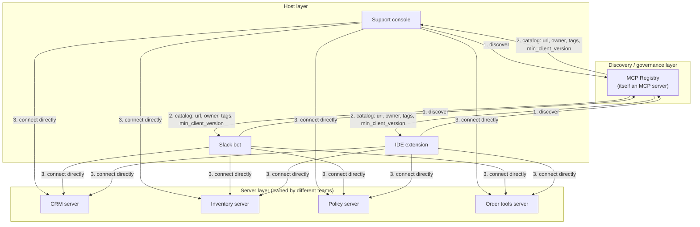
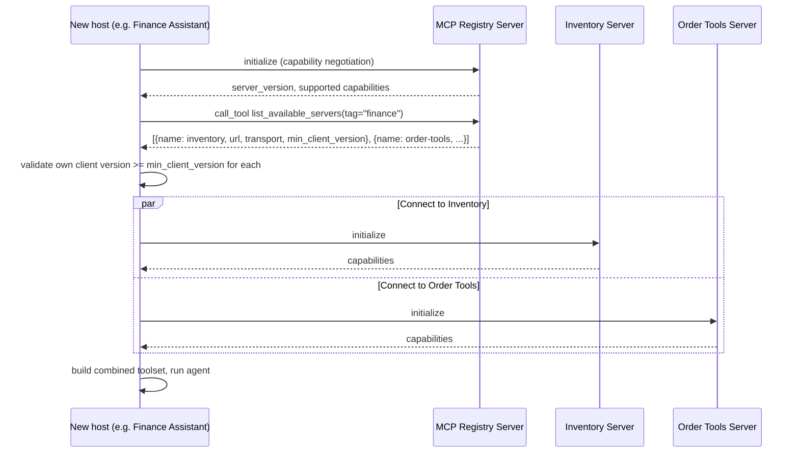

# Pattern 7: MCP Architecture

[← Back to index](./README.md)

## 1. Introduce the pattern

Patterns 1–6 each looked at one moving part in isolation. **MCP Architecture** is about how those
parts compose at company scale: dozens of servers, multiple hosts, a shared way to discover
what's available, and a consistent capability-negotiation contract between every client and every
server. Three layers show up in every real MCP deployment:

- **Host layer** — the user-facing applications (a support console, a Slack bot, an IDE
  extension). Each owns an LLM and a set of MCP client connections.
- **Discovery/governance layer** — how a host learns *which* servers exist, who owns them, and
  whether it's allowed to use them, without hardcoding a server list into every host's config.
- **Server layer** — the many independent MCP servers built by different teams (Patterns 1–6's
  runbook, CRM, inventory, policy, order, and prompt servers are all examples of this layer).



## 2. The problem it solves

Once an organization has more than a handful of MCP servers, hardcoding each host's server list
(what Pattern 2 did with a plain `SERVER_CONFIG` dict) starts to break down:

- **Config sprawl**: every new host has to copy, and keep updating, a list of every server it
  might need — URLs drift, get stale, or point at decommissioned servers.
- **No central governance**: nothing stops a host from connecting to a server nobody approved for
  that use case, and nothing tells the platform team which hosts depend on which servers before
  they change or retire one.
- **Inconsistent versioning**: without an explicit capability-negotiation and versioning practice,
  a server upgrade can silently break a host that assumed an old input schema.

A **registry** — a small, central catalog of approved servers, discoverable at connection time —
turns "every host hardcodes every server" into "every host asks the registry, once, for what it
needs." Capability negotiation (built into the `initialize` handshake) and explicit server
versioning close the second gap.

## 3. A realistic production scenario

**Scenario: Enterprise AI Platform.** The platform team supports a growing number of internal MCP
servers (CRM, inventory, policy library, order tools, and more) built by different teams. Rather
than publish a shared config file every host must copy, they stand up a lightweight **MCP
Registry** — itself just another MCP server — whose only job is to answer "what servers exist,
tagged how, owned by whom, and how do I connect?"

Any new host (a fourth one launching next quarter, unknown today) needs zero prior knowledge of
individual servers: it queries the registry for servers tagged `"finance"`, gets back connection
details for exactly the ones it's approved to use, and connects directly to those — the registry
itself is never in the request path for actual tool calls, only for discovery.

## 4. Architecture / flow diagram



## 5. The complete request-to-response flow

1. **Registry connection.** A new host connects to exactly one well-known server: the registry.
   This is the *only* hardcoded MCP endpoint any host needs.
2. **Capability negotiation.** During `initialize`, both sides exchange declared capabilities and
   a protocol/server version. This is where a host would detect "this server is too old/new for
   me" *before* attempting to use it — the negotiation, not a runtime error, is the right place to
   catch that.
3. **Catalog query.** The host calls a tool (or reads a resource — either is a reasonable design)
   on the registry asking for servers matching its needs, e.g. tagged `"finance"`.
4. **Client-side filtering.** The host checks each candidate server's `min_client_version` against
   its own version, and drops any it can't safely talk to, logging why.
5. **Direct connections.** For every server that passes, the host opens its own, direct MCP
   connection (using exactly the client-layer machinery from Pattern 2) — the registry is not a
   proxy; it never sits between the host and the actual tool calls.
6. **Normal operation.** From here, everything proceeds exactly like Patterns 1–6: tools, resources,
   and prompts from the discovered servers are used normally.
7. **Change management.** When the platform team retires or moves a server, they update **one**
   entry in the registry. Every host picks up the change on its next discovery call — no
   per-host config deploys.

## 6. Why this pattern is appropriate

- **Decouples "what exists" from "what I use."** Hosts stay generic; new servers become available
  to every host automatically once registered, with no host-side code changes.
- **Central governance point.** The registry is a natural place to enforce which teams/servers are
  approved, without embedding that policy in every host.
- **Capability negotiation prevents silent breakage.** Explicit version checks at connection time
  turn a potential runtime failure (a tool's schema changed under you) into a clear, early,
  diagnosable rejection.
- **Scales with the org, not with the number of hosts.** Adding a fifth host doesn't mean writing
  a fifth server-list config — it inherits the registry.

Trade-off: the registry becomes a piece of shared infrastructure that itself needs to be
reliable — if it's down, *new* connections can't discover servers (existing, already-connected
hosts are unaffected, since the registry isn't in their runtime path). For a small number of
servers (fewer than, say, five to ten) a plain shared config file is simpler and this pattern is
premature; it earns its keep once discovery and governance genuinely become a coordination
problem.

## 7. Production-quality implementation

### 7.1 Install dependencies

```bash
pip install "mcp[cli]>=1.28,<2" "langchain-mcp-adapters>=0.2" \
            "langgraph>=1.2" "langchain-ollama>=0.3"
```

### 7.2 The registry — `mcp_registry_server.py`

```python
"""
mcp_registry_server.py

A lightweight, central catalog of approved internal MCP servers. This is
itself just an MCP server — hosts connect to it first (and only it needs to
be hardcoded), then connect directly to whatever it points them at.

Run:
    python mcp_registry_server.py
"""

from __future__ import annotations

from dataclasses import dataclass, field

from pydantic import BaseModel

from mcp.server.fastmcp import FastMCP

mcp = FastMCP(
    name="mcp-registry",
    instructions="Discover approved internal MCP servers by tag before connecting to them directly.",
)


@dataclass(frozen=True)
class ServerEntry:
    name: str
    url: str
    transport: str
    owning_team: str
    tags: tuple[str, ...]
    min_client_version: str


# In production this catalogue would live in a small database the platform
# team updates via a self-service form or CI job — not a code deploy.
_CATALOGUE: list[ServerEntry] = [
    ServerEntry(
        name="inventory-pricing",
        url="http://inventory.internal:8000/mcp",
        transport="streamable_http",
        owning_team="commerce-platform",
        tags=("finance", "commerce"),
        min_client_version="1.0.0",
    ),
    ServerEntry(
        name="order-tools",
        url="http://orders.internal:8000/mcp",
        transport="streamable_http",
        owning_team="commerce-platform",
        tags=("finance", "support"),
        min_client_version="1.0.0",
    ),
    ServerEntry(
        name="policy-library",
        url="http://policies.internal:8000/mcp",
        transport="streamable_http",
        owning_team="compliance",
        tags=("compliance", "support"),
        min_client_version="1.2.0",
    ),
]


class ServerListing(BaseModel):
    name: str
    url: str
    transport: str
    owning_team: str
    min_client_version: str


@mcp.tool()
def list_available_servers(tag: str | None = None) -> list[ServerListing]:
    """List approved internal MCP servers, optionally filtered by tag (e.g. 'finance')."""
    matches = [e for e in _CATALOGUE if tag is None or tag in e.tags]
    return [
        ServerListing(
            name=e.name,
            url=e.url,
            transport=e.transport,
            owning_team=e.owning_team,
            min_client_version=e.min_client_version,
        )
        for e in matches
    ]


if __name__ == "__main__":
    mcp.run(transport="stdio")
```

### 7.3 A host that bootstraps itself from the registry — `finance_assistant.py`

```python
"""
finance_assistant.py

A new host that starts with zero hardcoded server knowledge beyond the
registry itself: discovers finance-tagged servers, validates version
compatibility, then connects directly to each one.
"""

from __future__ import annotations

import asyncio
import logging

from mcp import ClientSession, StdioServerParameters
from mcp.client.stdio import stdio_client
from langchain_mcp_adapters.client import MultiServerMCPClient
from langchain_ollama import ChatOllama
from langgraph.prebuilt import create_react_agent

logging.basicConfig(level=logging.INFO)
logger = logging.getLogger("finance_assistant")

CLIENT_VERSION = (1, 1, 0)  # this host's own MCP-client capability level


def _version_tuple(v: str) -> tuple[int, ...]:
    return tuple(int(part) for part in v.split("."))


async def discover_servers(tag: str) -> list[dict]:
    """Query the registry for approved servers matching a tag."""
    registry_params = StdioServerParameters(command="python", args=["mcp_registry_server.py"])
    async with stdio_client(registry_params) as (read, write):
        async with ClientSession(read, write) as session:
            await session.initialize()
            result = await session.call_tool("list_available_servers", {"tag": tag})
            return result.structuredContent["result"] if "result" in result.structuredContent else result.structuredContent


async def build_server_config(tag: str) -> dict[str, dict]:
    """Turn registry entries into a MultiServerMCPClient config, dropping incompatible servers."""
    entries = await discover_servers(tag)
    config: dict[str, dict] = {}
    for entry in entries:
        if _version_tuple(entry["min_client_version"]) > CLIENT_VERSION:
            logger.warning(
                "Skipping '%s': requires client >= %s, this host is %s",
                entry["name"], entry["min_client_version"], CLIENT_VERSION,
            )
            continue
        config[entry["name"]] = {"url": entry["url"], "transport": entry["transport"]}
        logger.info("Discovered server '%s' owned by %s", entry["name"], entry["owning_team"])
    return config


async def main() -> None:
    server_config = await build_server_config(tag="finance")
    if not server_config:
        raise RuntimeError("No compatible finance-tagged servers discovered")

    mcp_client = MultiServerMCPClient(server_config)
    tools = await mcp_client.get_tools()
    logger.info("Bootstrapped with tools: %s", [t.name for t in tools])

    model = ChatOllama(model="llama3.1", temperature=0)
    agent = create_react_agent(model, tools, prompt="You are a finance operations assistant.")

    result = await agent.ainvoke(
        {"messages": [{"role": "user", "content": "Is SKU-200 in stock for at least 5 units?"}]}
    )
    print(result["messages"][-1].content)


if __name__ == "__main__":
    asyncio.run(main())
```

### 7.4 What happens when you run it

1. `finance_assistant.py` knows about exactly one hardcoded thing: how to reach the registry.
2. It discovers two finance-tagged servers (`inventory-pricing`, `order-tools`) — `policy-library`
   is filtered out because it's tagged `compliance`/`support`, not `finance`.
3. If the platform team later bumps `policy-library`'s `min_client_version` past what an older
   host declares, that host's `build_server_config` skips it with a clear log line instead of
   failing confusingly deep inside a tool call.
4. A brand-new fifth host, written next quarter, needs **zero** changes to this registry to start
   using `inventory-pricing` — it just queries with `tag="finance"` too.

This is the "zoomed out" view every later pattern in this series sits inside: **Tool Discovery**
(Pattern 8) and **Dynamic Tool Discovery** (Pattern 9) dig into what happens *after* a host has
connected to a server; **MCP Tool Routing** (Pattern 12) and **Multi-MCP Architecture**
(Pattern 16) go deeper on choosing between many already-connected servers at request time.

---

[← Back to index](./README.md)
