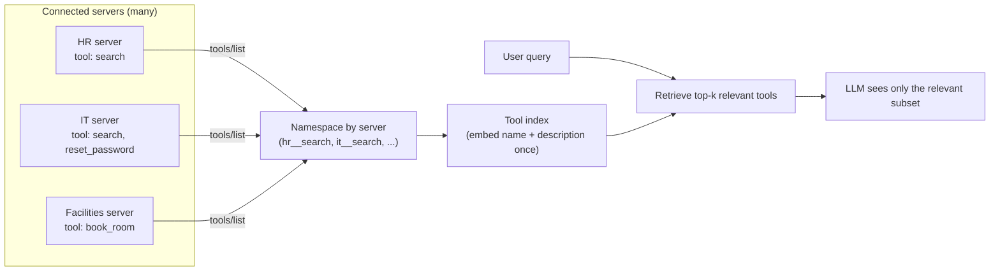

# Pattern 8: Tool Discovery

[← Back to index](./README.md)

## 1. Introduce the pattern

**Tool Discovery** is what a host does *after* connecting to one or more servers: turning
`tools/list` results from every connected server into the actual toolset an LLM call sees. At
small scale (one server, five tools) this is trivial — just list them all. At real scale (a dozen
servers, 80+ tools combined) two problems show up that this pattern exists to solve:

- **Name collisions.** Two independently-built servers can both expose a tool called `search` (an
  HR knowledge-base search and an IT knowledge-base search) — naively merging their tool lists
  means one silently shadows the other.
- **Tool overload.** LLMs choose tools less reliably as the candidate list grows — handing every
  connected server's every tool to every request degrades both selection accuracy and cost/latency
  (larger tool-schema payload on every call), regardless of whether most of them are relevant to
  the current question.

Tool discovery is the layer between "what's connected" and "what the model sees this turn":
namespace to avoid collisions, then narrow to what's relevant.



## 2. The problem it solves

Imagine a company-wide IT helpdesk agent connected — via the registry pattern from Pattern 7 — to
every server tagged `"internal-support"`: HR, IT, Facilities, and a dozen more. Without a
discovery layer:

1. Merging all their tools by name risks **silent collisions** — if HR's `search` happens to be
   registered after IT's `search`, IT's version quietly disappears from the toolset with no error.
2. Every single request pays the token/latency cost of describing **all 80+ tools**, even when the
   user asked something only three of them are relevant to.
3. The model's tool-selection accuracy measurably drops as the candidate set grows — a question
   about booking a conference room shouldn't have to compete for the model's attention against 79
   unrelated tools.

## 3. A realistic production scenario

**Scenario: Universal IT Helpdesk Agent.** Connected (via the Pattern 7 registry) to HR, IT, and
Facilities servers — a small stand-in for what would be a dozen-plus real servers. Two of them
happen to both expose a tool literally named `search`. The helpdesk team needs:

- Every tool from every connected server to be **unambiguously addressable** — no silent
  shadowing.
- Each user request to only see the **handful of tools actually relevant** to it, selected
  automatically, not through a hardcoded per-topic tool list (new servers get added over time and
  should participate in discovery without code changes).

## 4. Architecture / flow diagram

```mermaid
sequenceDiagram
    participant Host as Helpdesk Agent (startup)
    participant HR as HR Server
    participant IT as IT Server
    participant FAC as Facilities Server
    participant Idx as Tool Index (in-memory embeddings)

    Host->>HR: tools/list
    HR-->>Host: [search]
    Host->>IT: tools/list
    IT-->>Host: [search, reset_password]
    Host->>FAC: tools/list
    FAC-->>Host: [book_room]
    Host->>Host: namespace -> hr__search, it__search,\nit__reset_password, facilities__book_room
    Host->>Idx: embed each "name: description" once

    Note over Host: --- per user turn ---
    Host->>Idx: embed("my badge doesn't unlock the server room")
    Idx-->>Host: top-3: [it__reset_password? no; facilities__book_room? no; ...]
    Host->>Host: build agent with only the top-k relevant tools
```

## 5. The complete request-to-response flow

1. **Connect and list.** At startup, the host connects to every configured server (using the
   Pattern 2 client layer) and calls `tools/list` on each.
2. **Namespace.** Every tool is renamed `{server_name}__{tool_name}` before merging — this alone
   guarantees `hr__search` and `it__search` coexist instead of colliding, at the small cost of a
   slightly less friendly name (mitigated by keeping the original tool's `description` intact, so
   the model still understands *what* it does).
3. **Index once.** Each namespaced tool's `name: description` text is embedded a single time at
   startup (or whenever the connected server set changes — see Pattern 9) and stored with its
   vector in a lightweight in-memory index. This cost is paid once, not per request.
4. **Per-request retrieval.** When a user message arrives, the host embeds *that message* and
   retrieves the top-k most similar tools by cosine similarity — typically 5–10, regardless of how
   many are connected in total.
5. **Scoped agent construction.** The LangGraph agent is built (or its tool list updated) using
   only the retrieved subset for this turn — the model never sees the other 70+ irrelevant tools.
6. **Normal execution.** From here, tool calls proceed exactly as in earlier patterns — the model
   picks from its (now much smaller, much more relevant) menu.

## 6. Why this pattern is appropriate

- **Eliminates collisions structurally** — namespacing means two servers can never accidentally
  clash, without either server needing to know about the other.
- **Improves tool-selection accuracy** — a model choosing between 5 relevant tools outperforms one
  choosing between 80, almost regardless of model quality.
- **Reduces cost and latency** — every request's tool-schema payload shrinks to just what's
  relevant.
- **Scales with the organization** — new servers just need reasonable tool descriptions to
  participate in retrieval; no per-server integration code in the host.

Trade-off: embedding-based retrieval can miss a relevant tool if its description doesn't overlap
semantically with the user's phrasing (a real risk — mitigate with good tool descriptions, a
slightly larger *k*, or a hybrid keyword+embedding retrieval). For a genuinely small, stable tool
set (under ~15–20 tools), skip this pattern entirely — the overhead isn't worth it until the model
actually starts struggling with tool volume.

## 7. Production-quality implementation

### 7.1 Install dependencies

```bash
pip install "mcp[cli]>=1.28,<2" "langchain-mcp-adapters>=0.2" \
            "langgraph>=1.2" "langchain-ollama>=0.3" numpy
ollama pull llama3.1
ollama pull nomic-embed-text
```

### 7.2 Three small servers with a deliberate name collision

```python
"""
hr_server.py — exposes `search` over the HR handbook.
"""
from mcp.server.fastmcp import FastMCP

mcp = FastMCP(name="hr-server")

_HANDBOOK = {
    "pto": "Employees accrue 15 PTO days/year, prorated by start date.",
    "badge": "Lost badges are replaced by Security within 1 business day.",
}


@mcp.tool()
def search(query: str) -> list[str]:
    """Search the HR employee handbook for policies like PTO, benefits, or badges."""
    q = query.lower()
    return [v for k, v in _HANDBOOK.items() if q in k or q in v.lower()]


if __name__ == "__main__":
    mcp.run(transport="stdio")
```

```python
"""
it_server.py — also exposes `search` (over IT articles), plus reset_password.
"""
from mcp.server.fastmcp import FastMCP

mcp = FastMCP(name="it-server")

_ARTICLES = {
    "vpn": "Reconnect the VPN client and select the 'us-east' gateway if it times out.",
    "badge": "If a badge doesn't unlock server room doors, file an access-request ticket.",
}


@mcp.tool()
def search(query: str) -> list[str]:
    """Search internal IT knowledge base articles like VPN issues or access problems."""
    q = query.lower()
    return [v for k, v in _ARTICLES.items() if q in k or q in v.lower()]


@mcp.tool()
def reset_password(user_id: str) -> dict[str, str]:
    """Reset an employee's network password by their user id."""
    return {"user_id": user_id, "status": "reset_email_sent"}


if __name__ == "__main__":
    mcp.run(transport="stdio")
```

```python
"""
facilities_server.py — exposes book_room.
"""
from mcp.server.fastmcp import FastMCP

mcp = FastMCP(name="facilities-server")


@mcp.tool()
def book_room(room_name: str, start_time: str) -> dict[str, str]:
    """Book a conference room by name and an ISO start time."""
    return {"room_name": room_name, "start_time": start_time, "status": "booked"}


if __name__ == "__main__":
    mcp.run(transport="stdio")
```

### 7.3 The discovery layer — `tool_discovery.py`

```python
"""
tool_discovery.py

Connects to every configured server, namespaces tools to eliminate
collisions, embeds each tool once, and retrieves only the top-k most
relevant tools for a given user query.

Run:
    python tool_discovery.py
"""

from __future__ import annotations

import asyncio
import logging

import numpy as np
from langchain_core.tools import BaseTool, StructuredTool
from langchain_mcp_adapters.client import MultiServerMCPClient
from langchain_ollama import ChatOllama, OllamaEmbeddings
from langgraph.prebuilt import create_react_agent

logging.basicConfig(level=logging.INFO)
logger = logging.getLogger("tool_discovery")

SERVER_CONFIG: dict[str, dict] = {
    "hr": {"command": "python", "args": ["hr_server.py"], "transport": "stdio"},
    "it": {"command": "python", "args": ["it_server.py"], "transport": "stdio"},
    "facilities": {"command": "python", "args": ["facilities_server.py"], "transport": "stdio"},
}


def _namespace_tool(server_name: str, tool: BaseTool) -> BaseTool:
    """Rename a tool to {server}__{name} to make collisions structurally impossible."""
    namespaced = tool.model_copy(update={"name": f"{server_name}__{tool.name}"})
    return namespaced


class ToolIndex:
    """A minimal, dependency-light semantic index over available MCP tools."""

    def __init__(self, embeddings: OllamaEmbeddings) -> None:
        self._embeddings = embeddings
        self._tools: list[BaseTool] = []
        self._vectors: np.ndarray | None = None

    async def build(self, tools: list[BaseTool]) -> None:
        self._tools = tools
        texts = [f"{t.name}: {t.description}" for t in tools]
        raw_vectors = await self._embeddings.aembed_documents(texts)
        self._vectors = np.array(raw_vectors, dtype=np.float32)
        # Normalize once so retrieval is a plain dot product (cosine similarity).
        self._vectors /= np.linalg.norm(self._vectors, axis=1, keepdims=True)
        logger.info("Indexed %d tools", len(tools))

    async def retrieve(self, query: str, k: int = 5) -> list[BaseTool]:
        if self._vectors is None or not self._tools:
            return []
        query_vec = np.array(await self._embeddings.aembed_query(query), dtype=np.float32)
        query_vec /= np.linalg.norm(query_vec)
        scores = self._vectors @ query_vec
        top_indices = np.argsort(-scores)[:k]
        selected = [self._tools[i] for i in top_indices]
        logger.info(
            "Retrieved for %r: %s", query, [(self._tools[i].name, round(float(scores[i]), 3)) for i in top_indices]
        )
        return selected


async def discover_all_tools(client: MultiServerMCPClient) -> list[BaseTool]:
    """List and namespace tools from every connected server."""
    all_tools: list[BaseTool] = []
    for server_name in SERVER_CONFIG:
        server_tools = await client.get_tools(server_name=server_name)
        all_tools.extend(_namespace_tool(server_name, t) for t in server_tools)
    logger.info("Discovered %d namespaced tools total: %s", len(all_tools), [t.name for t in all_tools])
    return all_tools


async def main() -> None:
    client = MultiServerMCPClient(SERVER_CONFIG)
    all_tools = await discover_all_tools(client)

    embeddings = OllamaEmbeddings(model="nomic-embed-text")
    index = ToolIndex(embeddings)
    await index.build(all_tools)

    model = ChatOllama(model="llama3.1", temperature=0)

    question = "My badge won't let me into the server room, what should I do?"
    relevant_tools = await index.retrieve(question, k=3)
    logger.info("Building agent with only: %s", [t.name for t in relevant_tools])

    agent = create_react_agent(model, relevant_tools, prompt="You are an internal helpdesk assistant.")
    result = await agent.ainvoke({"messages": [{"role": "user", "content": question}]})
    print("\n--- Assistant response ---")
    print(result["messages"][-1].content)


if __name__ == "__main__":
    asyncio.run(main())
```

### 7.4 What happens when you run it

1. `discover_all_tools` returns four namespaced tools: `hr__search`, `it__search`,
   `it__reset_password`, `facilities__book_room` — no collision, both `search` tools coexist.
2. For the query *"My badge won't let me into the server room"*, `index.retrieve(..., k=3)` scores
   `it__search` highest (its article literally mentions badge/server-room access), followed by
   `hr__search` (badges are also an HR handbook topic) and `it__reset_password` as the third-place
   fallback — `facilities__book_room` scores lowest and is correctly excluded.
3. The agent is built with only those 3 tools, not all 4 (or all 80, at real scale) — a smaller,
   more relevant, cheaper decision for the model to make.
4. Because indexing happens once (`index.build`) and retrieval is a cheap in-memory dot product
   per request, this scales to hundreds of tools without adding meaningful per-request latency.

Next up: **Dynamic Tool Discovery** — what changes when the set of connected servers (and
therefore tools) isn't fixed at startup, but changes *while the agent is running*.

---

[← Back to index](./README.md)
