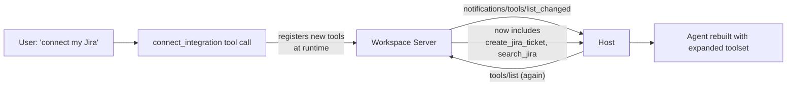
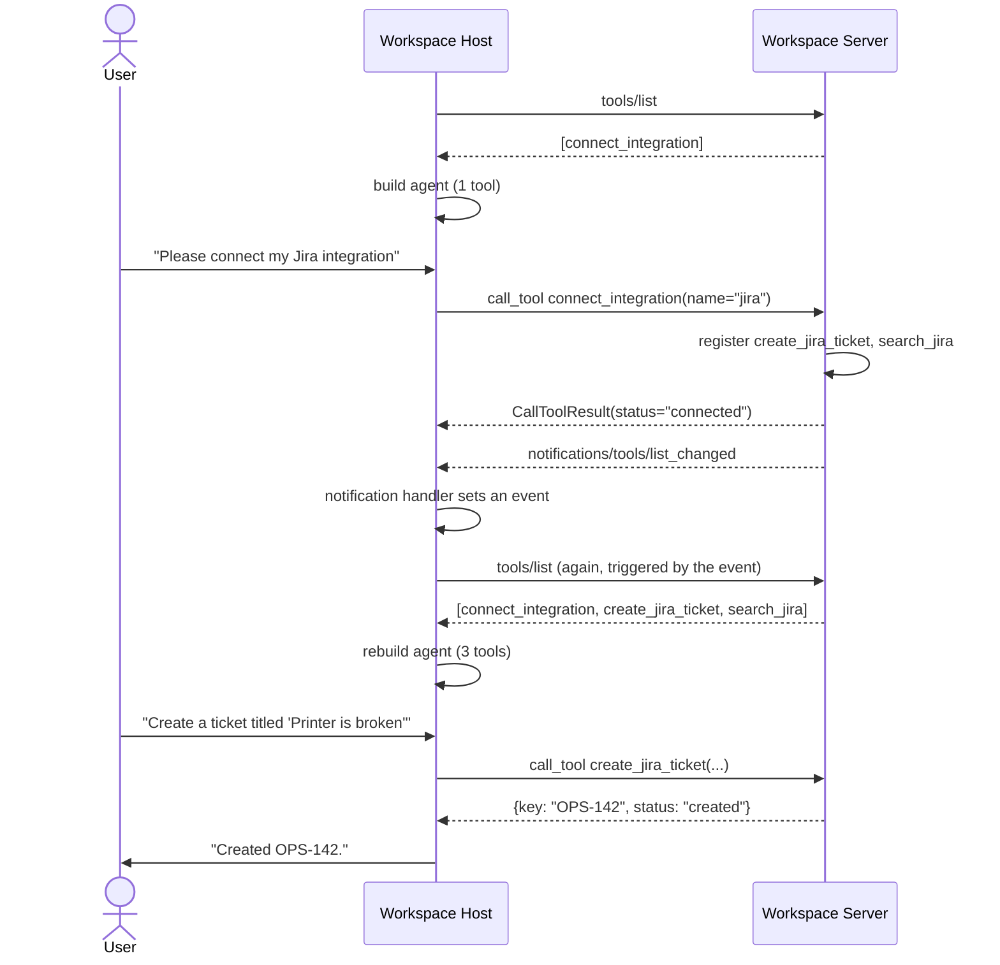

# Pattern 9: Dynamic Tool Discovery

[← Back to index](./README.md)

## 1. Introduce the pattern

Pattern 8 assumed the set of tools was fixed once discovery ran at startup. **Dynamic Tool
Discovery** is what happens when that assumption breaks — a server's available tools change
*while a session is already running*, and the host needs to notice and react without a restart or
reconnect.

This happens for very ordinary reasons: a user connects a new third-party integration mid-session
(think: "connect my Jira account" inside an ongoing chat), a feature flag flips on for their
account, or an admin enables a capability that was previously gated. MCP has a built-in mechanism
for exactly this: servers can register new tools at runtime and send a
`notifications/tools/list_changed` message; well-behaved hosts listen for it and re-run
discovery.



## 2. The problem it solves

Without this pattern, a host that discovers tools only once at connection time has two bad
options when a server's capabilities change mid-session: **ignore the change** (the newly
connected Jira integration is invisible until the user restarts the conversation — a confusing,
broken-feeling experience), or **poll** `tools/list` on a timer (wasteful, and still introduces a
delay between the change and the host noticing).

The `tools/list_changed` notification gives the host an event-driven, immediate signal: the
server pushes a message the instant its tool set changes, and the host reacts exactly then — no
polling, no restart, no stale toolset.

## 3. A realistic production scenario

**Scenario: Extensible AI Workspace assistant.** Users can connect third-party integrations
(Jira, Slack, Drive, ...) to their assistant at any point during a conversation, not just at
setup. The workspace's MCP server starts with a single tool, `connect_integration(name)`. The
moment a user connects Jira:

1. The server **registers two new tools at runtime** — `create_jira_ticket` and `search_jira`.
2. The server **sends `tools/list_changed`** to notify the connected host.
3. The host **re-discovers tools live** and rebuilds the agent's toolset — so the very next
   message in the *same* conversation can use the newly connected integration.

## 4. Architecture / flow diagram



## 5. The complete request-to-response flow

1. **Initial discovery.** At connection time, the host lists tools normally — in this scenario,
   just `connect_integration`.
2. **Notification handler registered.** Before the first message is even sent, the host wires a
   `message_handler` on its `ClientSession` that watches for `ToolListChangedNotification` and
   sets an `asyncio.Event` when one arrives — this is the event-driven trigger, not a poll loop.
3. **User triggers the change.** The user asks to connect Jira; the model calls
   `connect_integration("jira")`.
4. **Server-side runtime registration.** Inside that tool's handler, the server calls
   `mcp.add_tool(...)` twice (for `create_jira_ticket` and `search_jira`) — the same mechanism the
   `@mcp.tool()` decorator uses internally, just invoked programmatically at runtime instead of at
   import time.
5. **Notification sent.** Immediately after registering the new tools, the handler calls
   `await ctx.session.send_tool_list_changed()`.
6. **Host reacts.** The waiting `asyncio.Event` fires; the host calls `tools/list` again and gets
   back all three tools this time.
7. **Agent rebuilt, same conversation.** The host constructs a fresh LangGraph agent with the
   expanded toolset — no reconnect, no new session, no lost conversation state — and the very next
   user turn can use `create_jira_ticket` directly.

## 6. Why this pattern is appropriate

- **No artificial restart requirement.** Users expect "connect an integration" to work
  immediately, in the same conversation — this pattern delivers exactly that.
- **Event-driven, not polling.** `tools/list_changed` means zero wasted requests while nothing has
  changed, and zero added latency once something does.
- **Symmetric with removal.** The same mechanism (and the same host-side handler) covers a tool
  becoming *unavailable* (e.g. a service is disconnected) — the host just re-lists and gets a
  smaller set; no special-case code needed for the "shrinking" direction.

Trade-off: rebuilding the agent's tool list mid-conversation means any in-flight reasoning that
assumed the old toolset should be treated carefully — in this example we rebuild between turns,
which is the safe boundary; swapping tools out from underneath a model *mid tool-call* is not
something the protocol handles for you and should be avoided by design.

## 7. Production-quality implementation

### 7.1 Install dependencies

```bash
pip install "mcp[cli]>=1.28,<2" "langchain-mcp-adapters>=0.2" \
            "langgraph>=1.2" "langchain-ollama>=0.3"
ollama pull llama3.1
```

### 7.2 The server — `workspace_server.py`

```python
"""
workspace_server.py

Starts with a single connect_integration tool. Connecting an integration
registers new tools at runtime and notifies the client via
tools/list_changed, so the change is visible within the same session.

Run:
    python workspace_server.py
"""

from __future__ import annotations

import logging
from collections.abc import Callable

from mcp.server.fastmcp import Context, FastMCP
from mcp.server.session import ServerSession

logging.basicConfig(level=logging.INFO)
logger = logging.getLogger("workspace_server")

mcp = FastMCP(
    name="workspace-server",
    instructions="Start with connect_integration to unlock tools for a third-party service.",
)

_CONNECTED: set[str] = set()


def _register_jira_tools() -> None:
    """Programmatically register Jira tools once the user connects Jira."""

    def create_jira_ticket(title: str, description: str = "") -> dict[str, str]:
        """Create a Jira ticket with a title and optional description."""
        return {"key": "OPS-142", "title": title, "status": "created"}

    def search_jira(query: str) -> list[dict[str, str]]:
        """Search existing Jira tickets by keyword."""
        return [{"key": "OPS-101", "title": f"Existing ticket matching '{query}'"}]

    # add_tool is the programmatic equivalent of the @mcp.tool() decorator —
    # useful when the tool's existence depends on runtime state.
    mcp.add_tool(create_jira_ticket, name="create_jira_ticket")
    mcp.add_tool(search_jira, name="search_jira")


_INTEGRATIONS: dict[str, Callable[[], None]] = {
    "jira": _register_jira_tools,
}


@mcp.tool()
async def connect_integration(name: str, ctx: Context[ServerSession, None]) -> dict[str, str]:
    """Connect a third-party integration (currently supported: 'jira') to unlock its tools."""
    key = name.lower()
    if key not in _INTEGRATIONS:
        raise ValueError(f"Unsupported integration '{name}'")
    if key in _CONNECTED:
        return {"status": "already_connected", "integration": key}

    _INTEGRATIONS[key]()
    _CONNECTED.add(key)

    # Notify the client that the tool list changed so it can re-discover
    # tools live, without reconnecting.
    await ctx.session.send_tool_list_changed()
    logger.info("integration '%s' connected; tool list changed notification sent", key)

    return {"status": "connected", "integration": key}


if __name__ == "__main__":
    mcp.run(transport="stdio")
```

### 7.3 The host — `workspace_host.py`

```python
"""
workspace_host.py

Reacts to a tools/list_changed notification mid-session: rediscovers tools
and rebuilds the agent, all within the same running conversation.

Run:
    python workspace_host.py
"""

from __future__ import annotations

import asyncio
import logging

from langchain_mcp_adapters.tools import load_mcp_tools
from langchain_ollama import ChatOllama
from langgraph.prebuilt import create_react_agent
from mcp import ClientSession, StdioServerParameters, types
from mcp.client.stdio import stdio_client

logging.basicConfig(level=logging.INFO)
logger = logging.getLogger("workspace_host")


async def main() -> None:
    tool_list_changed = asyncio.Event()

    async def on_message(message: object) -> None:
        """Watch every incoming server message for a tools/list_changed notification."""
        if isinstance(message, types.ServerNotification) and isinstance(
            message.root, types.ToolListChangedNotification
        ):
            logger.info("Received notifications/tools/list_changed")
            tool_list_changed.set()

    server_params = StdioServerParameters(command="python", args=["workspace_server.py"])
    model = ChatOllama(model="llama3.1", temperature=0)
    system_prompt = "You are a workspace assistant. Use connect_integration before using a service's tools."

    async with stdio_client(server_params) as (read, write):
        async with ClientSession(read, write, message_handler=on_message) as session:
            await session.initialize()

            tools = await load_mcp_tools(session)
            logger.info("Initial tools: %s", [t.name for t in tools])
            agent = create_react_agent(model, tools, prompt=system_prompt)

            turn_1 = "Please connect the jira integration for me."
            result = await agent.ainvoke({"messages": [{"role": "user", "content": turn_1}]})
            print("\n--- Turn 1 ---")
            print(result["messages"][-1].content)

            # Event-driven wait: no polling, reacts the instant the server notifies us.
            await asyncio.wait_for(tool_list_changed.wait(), timeout=5.0)

            refreshed_tools = await load_mcp_tools(session)
            logger.info("Refreshed tools: %s", [t.name for t in refreshed_tools])
            agent = create_react_agent(model, refreshed_tools, prompt=system_prompt)

            turn_2 = "Create a jira ticket titled 'Printer on 4th floor is broken'."
            result = await agent.ainvoke({"messages": [{"role": "user", "content": turn_2}]})
            print("\n--- Turn 2 ---")
            print(result["messages"][-1].content)


if __name__ == "__main__":
    asyncio.run(main())
```

### 7.4 What happens when you run it

1. **Turn 1** starts with only `connect_integration` available. The model calls it with
   `name="jira"`; server-side, `create_jira_ticket` and `search_jira` are registered and a
   `tools/list_changed` notification fires.
2. The host's `on_message` handler sets `tool_list_changed` the instant that notification arrives
   — there's no delay and no wasted polling in between.
3. `load_mcp_tools(session)` is called a second time and now returns all three tools; a fresh
   agent is built from them.
4. **Turn 2**, in the *same running process and the same MCP session*, successfully calls
   `create_jira_ticket` — a tool that did not exist when the conversation started.

Next up: **MCP Security** — now that servers can expose an evolving, sometimes-user-triggered set
of capabilities, we look at how to keep that safe: input validation, scoping what a session can
do, and defending against common MCP-specific attack surfaces.

---

[← Back to index](./README.md)
