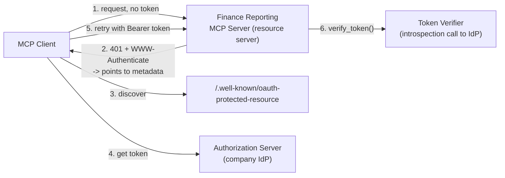
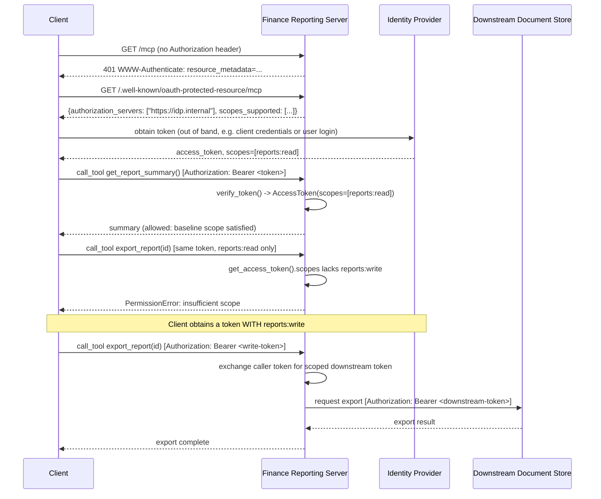

# Pattern 11: MCP Authorization

[← Back to index](./README.md)

## 1. Introduce the pattern

Pattern 10 covered *"is this input safe"*. **MCP Authorization** answers a different question:
*"is this caller allowed to do this at all?"* Over Streamable HTTP, an MCP server is an ordinary
OAuth 2.1 **resource server** — it never signs anyone in and never issues a token; it does exactly
one thing: look at the `Authorization: Bearer <token>` header on each request and decide whether
that token is valid and sufficiently scoped.

Three OAuth roles show up:

- **Authorization server** — the identity provider (Auth0, Okta, Entra, an internal IdP). It
  signs users in and issues tokens. You don't write this.
- **Resource server** — your MCP server. It verifies tokens and enforces scopes.
- **Client** — discovers which authorization server to use, obtains a token, and sends it with
  every request.



## 2. The problem it solves

Without built-in authorization, "which caller can do what" ends up bolted on inconsistently — one
server checks an API key in a custom header, another trusts anything on the internal network,
none of them agree on how to express "this caller can read reports but not export them." MCP's
authorization layer solves this by:

1. **Standardizing discovery.** A client that has never talked to your server before can find out
   *which* identity provider to authenticate against, automatically, via a well-known metadata
   endpoint — no out-of-band configuration needed.
2. **Standardizing enforcement.** Token verification and scope checking follow one pattern
   (`TokenVerifier` + `AuthSettings`) instead of ad hoc per-server logic.
3. **Preventing the confused-deputy problem.** A server that blindly forwards the caller's own
   token to a downstream API conflates "this caller is allowed to talk to me" with "this caller is
   allowed to do this specific downstream thing" — the fix is for the server to exchange the
   caller's token for its *own*, narrowly-scoped downstream token rather than forwarding the
   original.

## 3. A realistic production scenario

**Scenario: Finance Reporting MCP Server.** Exposed over Streamable HTTP to several internal
hosts. Requirements:

- Every request must carry a valid bearer token, verified against the company's identity
  provider — no anonymous access.
- `get_report_summary()` requires only the baseline `reports:read` scope.
- `export_report(report_id)` requires the stronger `reports:write` scope — most callers shouldn't
  have it, and the tool must check for it explicitly, not just rely on being reachable.
- When `export_report` calls the internal document store to actually generate the export, it must
  **not** forward the caller's original bearer token to that downstream system — it exchanges it
  for a narrowly-scoped, short-lived downstream token first, so the document store never sees (or
  has to trust) the original caller-facing token.

## 4. Architecture / flow diagram



## 5. The complete request-to-response flow

1. **Unauthenticated request rejected at the door.** A request with no (or an invalid) bearer
   token never reaches a tool handler at all — the SDK's auth middleware returns `401` with a
   `WWW-Authenticate` header pointing at the server's metadata document.
2. **Discovery.** A client unfamiliar with this server fetches
   `/.well-known/oauth-protected-resource/mcp`, an RFC 9728 Protected Resource Metadata document
   listing which authorization server(s) are trusted and which scopes are supported.
3. **Token acquisition (out of band).** The client authenticates against that authorization server
   and receives a bearer token — this part is entirely between the client and the IdP; the MCP
   server is never involved.
4. **Verification on every request.** For each subsequent call, the server's `TokenVerifier`
   inspects the `Authorization` header. A production verifier calls the IdP's RFC 7662
   introspection endpoint (or validates a signed JWT locally) rather than checking a static table.
5. **Baseline scope enforcement.** `AuthSettings.required_scopes` sets a floor — any token missing
   one of those scopes is rejected before any tool runs.
6. **Per-tool scope enforcement.** Some tools need *more* than the baseline. `export_report`
   explicitly checks `get_access_token().scopes` for `reports:write` and raises a clear
   `PermissionError` if it's missing — this is where fine-grained, tool-level authorization lives,
   on top of the connection-level floor.
7. **Confused-deputy-safe downstream calls.** Before calling the internal document store,
   `export_report` exchanges the caller's token for a downstream-scoped token specific to that
   call, rather than forwarding the original — the document store trusts a token minted
   specifically for this purpose, not a general-purpose caller credential.

## 6. Why this pattern is appropriate

- **Standardized, not bespoke.** Every server in the organization implements the same
  `TokenVerifier` contract, so security review and tooling (like the registry from Pattern 7) can
  reason about auth consistently across servers.
- **Scopes express real business boundaries.** "Can read reports" and "can export reports" are
  genuinely different privileges — encoding that as two scopes, checked at two different layers
  (connection floor + per-tool), matches how the business actually thinks about the risk.
- **Token exchange closes a real hole.** Forwarding a caller's token to every downstream system it
  touches means a compromised downstream system can replay that token anywhere else it's accepted
  — narrowly-scoped, per-call downstream tokens contain the blast radius.

Trade-off: this entire layer only applies over HTTP transports — `stdio` has no `Authorization`
header, so a `stdio` server's security boundary is simply "who can launch this process" (the OS
handles that). Don't reach for OAuth machinery for a purely local, subprocess-launched server;
reach for it the moment a server is reachable over a network by more than one trusted process.

## 7. Production-quality implementation

### 7.1 Install dependencies

```bash
pip install "mcp[cli]>=1.28,<2" httpx
```

### 7.2 The server — `finance_auth_server.py`

```python
"""
finance_auth_server.py

Finance reporting server as an OAuth 2.1 resource server: verifies bearer
tokens via introspection, enforces a baseline scope for all tools, enforces
a stronger scope for the export tool specifically, and exchanges the
caller's token for a narrowly-scoped downstream token before calling the
internal document store (avoiding the confused-deputy problem).

Run:
    python finance_auth_server.py
Serves on http://127.0.0.1:8000/mcp
"""

from __future__ import annotations

import logging
import time

import httpx
from pydantic import AnyHttpUrl

from mcp.server.auth.middleware.auth_context import get_access_token
from mcp.server.auth.provider import AccessToken, TokenVerifier
from mcp.server.auth.settings import AuthSettings
from mcp.server.fastmcp import FastMCP

logging.basicConfig(level=logging.INFO)
logger = logging.getLogger("finance_auth_server")


class IntrospectionTokenVerifier(TokenVerifier):
    """Verifies bearer tokens against the company IdP's RFC 7662 introspection endpoint.

    This is the production shape: no local secrets, no static token table —
    every request is checked against the source of truth in real time.
    """

    def __init__(self, introspection_url: str, client_id: str, client_secret: str) -> None:
        self._introspection_url = introspection_url
        self._client_id = client_id
        self._client_secret = client_secret

    async def verify_token(self, token: str) -> AccessToken | None:
        async with httpx.AsyncClient() as http:
            try:
                resp = await http.post(
                    self._introspection_url,
                    data={"token": token},
                    auth=(self._client_id, self._client_secret),
                    timeout=5.0,
                )
                resp.raise_for_status()
            except httpx.HTTPError as exc:
                logger.warning("introspection call failed: %s", exc)
                return None

        data = resp.json()
        if not data.get("active", False):
            return None

        return AccessToken(
            token=token,
            client_id=data["client_id"],
            scopes=data.get("scope", "").split(),
            expires_at=data.get("exp"),
        )


async def exchange_token_for_downstream(caller_token: str, downstream_audience: str) -> str:
    """Simulates an RFC 8693 token exchange: swap the caller's token for a
    short-lived, narrowly-scoped token minted specifically for one downstream
    system, instead of forwarding the caller's own token to it.
    """
    # In production this is a real call to the IdP's /token endpoint with
    # grant_type=urn:ietf:params:oauth:grant-type:token-exchange.
    logger.info("exchanging caller token for a scoped token audienced to %s", downstream_audience)
    return f"downstream-token-for-{downstream_audience}-{int(time.time())}"


mcp = FastMCP(
    "finance-reporting-server",
    token_verifier=IntrospectionTokenVerifier(
        introspection_url="https://idp.internal.example.com/oauth/introspect",
        client_id="finance-reporting-server",
        client_secret="__set_via_secret_manager__",
    ),
    auth=AuthSettings(
        issuer_url=AnyHttpUrl("https://idp.internal.example.com"),
        resource_server_url=AnyHttpUrl("http://127.0.0.1:8000/mcp"),
        required_scopes=["reports:read"],  # floor: every caller needs at least this
    ),
)


@mcp.tool()
def get_report_summary() -> dict[str, str]:
    """Get a high-level summary of the latest finance report. Requires reports:read."""
    token = get_access_token()
    logger.info("get_report_summary called by %s", token.client_id if token else "unknown")
    return {"period": "Q2-2026", "revenue_usd": "4.2M", "status": "final"}


@mcp.tool()
async def export_report(report_id: str) -> dict[str, str]:
    """Export a full report to the document store. Requires reports:write."""
    token = get_access_token()
    if token is None or "reports:write" not in token.scopes:
        raise PermissionError("This action requires the 'reports:write' scope")

    # Confused-deputy-safe: exchange for a downstream-scoped token instead
    # of forwarding the caller's own token to the document store.
    downstream_token = await exchange_token_for_downstream(token.token, "document-store")

    async with httpx.AsyncClient() as http:
        # In production this actually POSTs to the document store with
        # Authorization: Bearer {downstream_token}. Simulated here.
        logger.info(
            "exporting report '%s' to document store using downstream token (caller=%s)",
            report_id, token.client_id,
        )

    return {"report_id": report_id, "status": "exported", "exported_by": token.client_id}


if __name__ == "__main__":
    mcp.run(transport="streamable-http")
```

### 7.3 A client presenting a bearer token — `finance_client.py`

```python
"""
finance_client.py

Shows both the rejection path (no/insufficient token) and the success path
(valid token with the right scope), by sending the Authorization header
directly on a Streamable HTTP connection. A production client would obtain
this token via the full OAuth discovery-and-PKCE dance (see mcp.client.auth
/ OAuthClientProvider) rather than hardcoding it.
"""

from __future__ import annotations

import asyncio

from mcp import ClientSession
from mcp.client.streamable_http import streamablehttp_client


async def call_with_token(token: str | None, tool_name: str, arguments: dict) -> None:
    headers = {"Authorization": f"Bearer {token}"} if token else {}
    try:
        async with streamablehttp_client("http://127.0.0.1:8000/mcp", headers=headers) as (
            read, write, _,
        ):
            async with ClientSession(read, write) as session:
                await session.initialize()
                result = await session.call_tool(tool_name, arguments)
                print(f"[{tool_name}] ok:", result.structuredContent)
    except Exception as exc:
        print(f"[{tool_name}] rejected:", exc)


async def main() -> None:
    # No token at all: rejected before any tool runs.
    await call_with_token(None, "get_report_summary", {})

    # Token with only reports:read: fine for the summary, rejected for export.
    await call_with_token("read-only-token", "get_report_summary", {})
    await call_with_token("read-only-token", "export_report", {"report_id": "RPT-2026-Q2"})

    # Token with reports:write: export succeeds, using a downstream-exchanged token internally.
    await call_with_token("read-write-token", "export_report", {"report_id": "RPT-2026-Q2"})


if __name__ == "__main__":
    asyncio.run(main())
```

### 7.4 What happens when you run it

1. A request with **no token** is stopped at the door with a `401` before `get_report_summary`
   ever executes — the auth middleware, not application code, enforces this.
2. A **read-only token** succeeds against `get_report_summary` (it only needs the baseline
   `reports:read` scope satisfied by `AuthSettings.required_scopes`) but is rejected by
   `export_report` with a clear `PermissionError` — the connection-level floor isn't enough for
   this specific tool.
3. A **read-write token** succeeds against `export_report`. Internally, the tool never forwards
   that token to the simulated document store — it exchanges it for a token scoped and audienced
   specifically to `"document-store"`, so even if that downstream system were compromised, it
   couldn't replay the caller's original credential anywhere else.
4. In every case, `get_access_token()` inside a tool handler is how the code knows who's calling
   and with what scopes — with no header parsing or manual token plumbing anywhere in the tool
   logic itself.

> **Note on stdio:** none of this applies to a `stdio`-launched server (used throughout most of
> this series) — `token_verifier`/`auth` only take effect on HTTP transports. A `stdio` server's
> trust boundary is simply "who can launch the process," which is why Patterns 1–6, 8, and 9 in
> this series didn't need authorization at all.

Next up: **MCP Tool Routing** — now that servers can be authorization-aware and discovery-aware,
we look at how a host chooses *which already-connected server* should handle a given request when
several could.

---

[← Back to index](./README.md)
