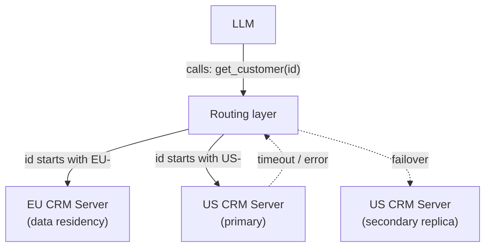
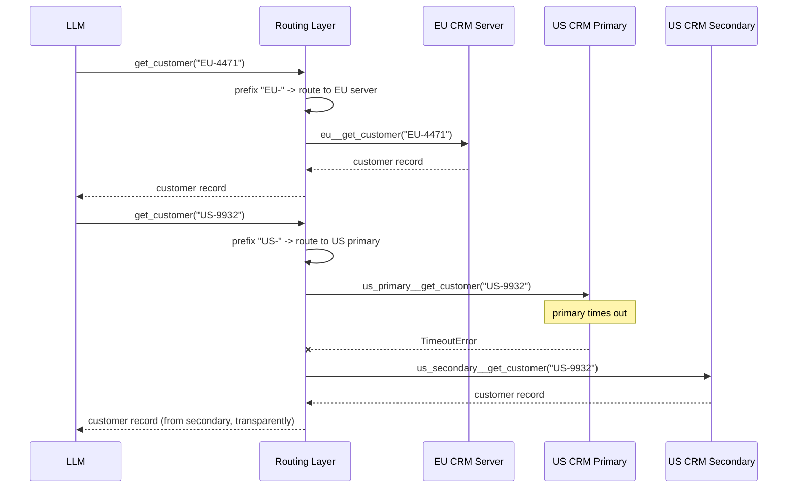

# Pattern 12: MCP Tool Routing

[← Back to index](./README.md)

## 1. Introduce the pattern

**MCP Tool Routing** is about what happens when *more than one already-connected server* could
plausibly handle the same logical request — and the decision of *which one actually gets called*
shouldn't be left to the model. This is different from Pattern 8 (Tool Discovery), which narrows
a large tool set down to what's *relevant*; routing is about picking the *correct* one among
several equivalent or near-equivalent options, according to rules the business — not the LLM —
defines.

Two routing needs show up constantly in production:

- **Deterministic, compliance-driven routing.** "EU customer data must be served by the EU
  server" isn't a judgment call the model should make per-request — it's a hard rule that must be
  enforced in code, every time, regardless of how the request is phrased.
- **Failover routing between equivalent servers.** If a primary server for a capability is slow or
  down, a secondary that does the same thing should be tried automatically — again, not something
  to leave to the model deciding "should I try someone else?"

The pattern's key move: expose **one generic tool** to the model (`get_customer`), and let a
router — plain code, not the LLM — decide which underlying server actually serves it.



## 2. The problem it solves

If the model itself chooses between `eu_crm__get_customer` and `us_crm__get_customer`, two things
can go wrong that a compliance team will not accept:

1. **Wrong-region calls from ordinary model unreliability.** Even a well-prompted model
   occasionally picks the wrong tool — for most tasks that's a minor inconvenience; for data
   residency, it can be a genuine compliance violation.
2. **No single place to enforce or audit the routing rule.** If "which server serves this
   customer" is implicit in the model's tool choice, there's no code path to point to when asked
   "how do we guarantee EU data never leaves the EU server?"

Similarly, without an explicit failover layer, a struggling primary server just produces failed
tool calls the model has to notice, reason about, and manually retry against a different tool —
unreliable and slow compared to a router that already knows the fallback chain.

## 3. A realistic production scenario

**Scenario: Multi-Region Customer Data Router.** A company runs separate CRM MCP servers per
region for data-residency compliance — an EU server and a US server, the latter with a secondary
replica for failover. Requirements:

- Customer IDs are prefixed by region (`EU-...`, `US-...`); the correct server **must** be chosen
  based on that prefix, deterministically, in code — never left to model judgment.
- The model sees exactly **one** tool, `get_customer(customer_id)` — it should never need to know
  region servers exist at all.
- If the US primary server times out or errors, the router automatically retries against the US
  secondary before giving up — the model sees one successful (or one clearly failed) call, not the
  retry mechanics.

## 4. Architecture / flow diagram



## 5. The complete request-to-response flow

1. **Single tool exposed.** The agent is built with one LangChain tool, `get_customer`, whose
   implementation is the router — not a direct MCP tool passthrough.
2. **Deterministic classification.** On each call, the router inspects `customer_id`'s prefix and
   maps it to a region — a plain, auditable `if`/`elif`, not an LLM judgment call.
3. **Region-specific dispatch.** For `EU-*`, the router calls the EU server's `get_customer`
   directly, since there's only one EU server and no failover need in this scenario.
4. **Primary attempt with a bounded timeout.** For `US-*`, the router calls the US primary server
   wrapped in `asyncio.wait_for(..., timeout=...)`.
5. **Automatic failover.** If the primary raises or times out, the router immediately retries the
   *same logical request* against the US secondary — the model never sees the failed primary
   attempt at all, only the final result (or a final, honest failure if both fail).
6. **Uniform result shape back to the model.** Regardless of which underlying server actually
   served the request, the router returns the same structured shape, so the model's downstream
   reasoning doesn't need to know or care which one it was.

## 6. Why this pattern is appropriate

- **Compliance enforcement lives in code, not in prompts.** "EU data only from the EU server" is
  guaranteed by a routing function's logic, not by hoping the system prompt is followed — this is
  the difference between a rule you can point to in a code review and a rule you can only hope
  held.
- **Failover is transparent and fast.** The model doesn't need multi-turn reasoning to notice a
  tool failed and try an alternative — the router handles that in milliseconds, inside a single
  tool call from the model's perspective.
- **The model's job gets simpler, not harder.** One tool, one clear contract — routing complexity
  is entirely hidden behind it.

Trade-off: the router itself becomes a single piece of logic multiple servers now depend on being
correct — test it directly and thoroughly, since a routing bug (e.g. a misclassified prefix) can
silently violate the exact compliance guarantee the pattern exists to provide. This is also not a
substitute for Pattern 11's authorization — routing decides *where* a request goes; authorization
still decides *whether* the caller was allowed to ask in the first place.

## 7. Production-quality implementation

### 7.1 Install dependencies

```bash
pip install "mcp[cli]>=1.28,<2" "langchain-mcp-adapters>=0.2" \
            "langgraph>=1.2" "langchain-ollama>=0.3"
ollama pull llama3.1
```

### 7.2 Three equivalent-shaped CRM servers

```python
"""
eu_crm_server.py — EU customer records (data-residency: EU server only).
"""
from mcp.server.fastmcp import FastMCP

mcp = FastMCP(name="eu-crm-server")

_CUSTOMERS = {"EU-4471": {"name": "Freya Lindqvist", "region": "EU", "plan": "Business"}}


@mcp.tool()
def get_customer(customer_id: str) -> dict[str, str]:
    """Look up an EU customer record by id."""
    return _CUSTOMERS.get(customer_id, {"error": f"No customer '{customer_id}'"})


if __name__ == "__main__":
    mcp.run(transport="stdio")
```

```python
"""
us_crm_primary_server.py — US customer records, primary instance.
"""
import asyncio
from mcp.server.fastmcp import FastMCP

mcp = FastMCP(name="us-crm-primary-server")

_CUSTOMERS = {"US-9932": {"name": "Jordan Blake", "region": "US", "plan": "Starter"}}


@mcp.tool()
async def get_customer(customer_id: str) -> dict[str, str]:
    """Look up a US customer record by id (primary instance)."""
    await asyncio.sleep(3.0)  # simulated slow/unhealthy primary, to trigger failover in the demo
    return _CUSTOMERS.get(customer_id, {"error": f"No customer '{customer_id}'"})


if __name__ == "__main__":
    mcp.run(transport="stdio")
```

```python
"""
us_crm_secondary_server.py — US customer records, secondary/DR instance.
"""
from mcp.server.fastmcp import FastMCP

mcp = FastMCP(name="us-crm-secondary-server")

_CUSTOMERS = {"US-9932": {"name": "Jordan Blake", "region": "US", "plan": "Starter"}}


@mcp.tool()
def get_customer(customer_id: str) -> dict[str, str]:
    """Look up a US customer record by id (secondary/DR instance)."""
    return _CUSTOMERS.get(customer_id, {"error": f"No customer '{customer_id}'"})


if __name__ == "__main__":
    mcp.run(transport="stdio")
```

### 7.3 The router — `customer_router.py`

```python
"""
customer_router.py

Exposes a single get_customer tool to the model. Internally, routes to the
EU server for EU-* ids (a hard compliance rule, not a model choice), and to
the US primary server for US-* ids with automatic failover to the US
secondary if the primary times out.

Run:
    python customer_router.py
"""

from __future__ import annotations

import asyncio
import logging

from langchain_core.tools import tool
from langchain_mcp_adapters.client import MultiServerMCPClient
from langchain_ollama import ChatOllama
from langgraph.prebuilt import create_react_agent

logging.basicConfig(level=logging.INFO)
logger = logging.getLogger("customer_router")

SERVER_CONFIG: dict[str, dict] = {
    "eu": {"command": "python", "args": ["eu_crm_server.py"], "transport": "stdio"},
    "us_primary": {"command": "python", "args": ["us_crm_primary_server.py"], "transport": "stdio"},
    "us_secondary": {"command": "python", "args": ["us_crm_secondary_server.py"], "transport": "stdio"},
}

PRIMARY_TIMEOUT_SECONDS = 1.5


async def build_router_tool(client: MultiServerMCPClient):
    eu_tools = {t.name: t for t in await client.get_tools(server_name="eu")}
    us_primary_tools = {t.name: t for t in await client.get_tools(server_name="us_primary")}
    us_secondary_tools = {t.name: t for t in await client.get_tools(server_name="us_secondary")}

    @tool
    async def get_customer(customer_id: str) -> dict[str, str]:
        """Look up a customer record by id. Works for any region automatically."""
        if customer_id.startswith("EU-"):
            logger.info("routing %s -> EU server (data residency rule)", customer_id)
            return await eu_tools["get_customer"].ainvoke({"customer_id": customer_id})

        if customer_id.startswith("US-"):
            logger.info("routing %s -> US primary", customer_id)
            try:
                return await asyncio.wait_for(
                    us_primary_tools["get_customer"].ainvoke({"customer_id": customer_id}),
                    timeout=PRIMARY_TIMEOUT_SECONDS,
                )
            except (TimeoutError, Exception) as exc:
                logger.warning(
                    "US primary failed for %s (%s); failing over to US secondary",
                    customer_id, exc,
                )
                return await us_secondary_tools["get_customer"].ainvoke({"customer_id": customer_id})

        raise ValueError(f"Cannot determine region for customer id '{customer_id}'")

    return get_customer


async def main() -> None:
    client = MultiServerMCPClient(SERVER_CONFIG)
    router_tool = await build_router_tool(client)

    model = ChatOllama(model="llama3.1", temperature=0)
    agent = create_react_agent(
        model,
        [router_tool],
        prompt="You are a customer support assistant. Use get_customer to look up any customer.",
    )

    for question in [
        "Look up customer EU-4471 and tell me their plan.",
        "Look up customer US-9932 and tell me their plan.",
    ]:
        result = await agent.ainvoke({"messages": [{"role": "user", "content": question}]})
        print(f"\nQ: {question}\nA: {result['messages'][-1].content}")


if __name__ == "__main__":
    asyncio.run(main())
```

### 7.4 What happens when you run it

1. The model only ever sees **one** tool, `get_customer` — it has no way to pick a region-specific
   server even if it wanted to, because none are exposed to it directly.
2. `EU-4471` routes straight to the EU server — always, deterministically, regardless of anything
   in the model's phrasing.
3. `US-9932` first attempts the (deliberately slowed-down) US primary; the `1.5s` timeout fires
   before the primary's simulated `3.0s` delay completes, and the router transparently retries
   against the US secondary, which succeeds — the model's tool call still returns one successful
   result, with no visibility into the failed primary attempt or the retry.
4. If both region servers for a given prefix were ever unreachable, the exception from the
   secondary attempt propagates up as a normal tool error the agent can report honestly, rather
   than being silently swallowed.

Next up: **MCP with Agents** — putting everything so far together into a full multi-step agentic
workflow that plans, calls multiple MCP tools in sequence, and adapts based on intermediate
results.

---

[← Back to index](./README.md)
