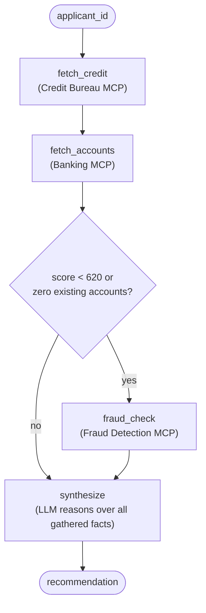
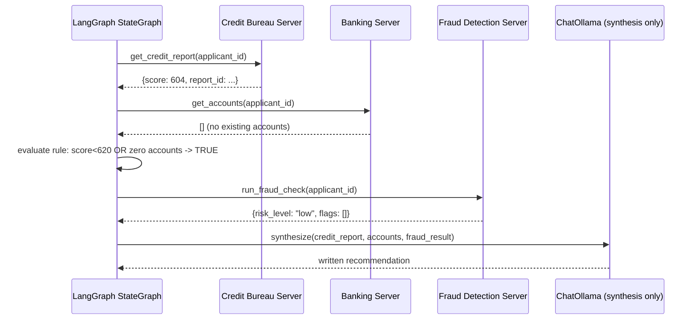

# Pattern 13: MCP with Agents

[← Back to index](./README.md)

## 1. Introduce the pattern

Every earlier pattern used a single-loop ReAct agent (`create_react_agent`) as a convenient way to
show one MCP concept at a time. **MCP with Agents** is about the more realistic shape production
systems actually take: a **multi-step LangGraph workflow** where some steps deterministically call
specific MCP tools (because the business process *requires* that step, regardless of what an LLM
would decide), some steps branch conditionally based on what earlier steps found, and only the
steps that genuinely need judgment are handed to an LLM at all.

This matters because not every step of a real process should be "the model decides what to do
next." A loan application must always pull a credit report — that's not a judgment call. Whether
it *additionally* needs a fraud check depends on what the credit report says — that's a rule, not
a guess. Only the final recommendation genuinely benefits from an LLM synthesizing several data
points into a coherent explanation.



## 2. The problem it solves

A single flat ReAct loop handed all three MCP servers' tools at once has two real weaknesses for
a process like underwriting:

1. **No guaranteed ordering.** Nothing forces the model to fetch the credit report *before*
   deciding whether a fraud check is needed — a plausible-looking but wrong sequence is entirely
   possible, and for a regulated process like lending, sequence matters (a fraud check decision
   should be informed by the credit data, not made blind).
2. **Judgment where a rule belongs.** "Should we run a fraud check" is a compliance-defined
   threshold ("if credit score < 620 or the applicant has no existing accounts"), not something
   that should vary based on how the model happens to interpret the situation each time.

Structuring this as an explicit LangGraph graph — deterministic nodes for data-gathering,
a deterministic conditional edge for the branch, and an LLM node only where synthesis genuinely
requires it — fixes both.

## 3. A realistic production scenario

**Scenario: Loan Underwriting Assistant.** Given an `applicant_id`, the system must:

1. Fetch the applicant's credit report from a **Credit Bureau** MCP server (always).
2. Fetch the applicant's existing account history from an internal **Banking** MCP server
   (always).
3. **Conditionally** run an additional check via a **Fraud Detection** MCP server — but only if
   the credit score is below 620 or the applicant has zero existing accounts (a defined
   compliance rule, evaluated deterministically after step 1–2 complete).
4. Synthesize everything gathered into a final, explained underwriting recommendation — this last
   step is where an LLM adds real value, turning several structured facts into a coherent
   narrative a human underwriter can quickly review.

## 4. Architecture / flow diagram



## 5. The complete request-to-response flow

1. **Graph invocation.** The workflow starts with just an `applicant_id` in state.
2. **Deterministic data gathering.** `fetch_credit` and `fetch_accounts` each call one specific
   MCP tool on one specific server — no model involved, no ambiguity about which tool runs or in
   what order.
3. **Deterministic conditional branch.** A plain Python function inspects the accumulated state
   (`credit_report["score"]`, `len(accounts)`) and returns which edge to follow — this is the
   compliance rule, expressed directly in code, not inferred by an LLM per request.
4. **Conditional data gathering.** Only when the rule fires does `fraud_check` run, calling the
   Fraud Detection server's tool.
5. **LLM synthesis, and only here.** The `synthesize` node is the *only* node in the graph that
   calls an LLM — it's given all the structured facts gathered so far and asked to produce a
   clear, human-readable recommendation with reasoning.
6. **Final state.** The graph's output includes both the structured facts (useful for
   downstream systems/audit) and the LLM's synthesized recommendation (useful for a human
   underwriter).

## 6. Why this pattern is appropriate

- **Determinism where it's required, judgment where it adds value.** The parts of the process that
  must always happen in a fixed order, or that follow a defined compliance rule, are plain code;
  only the genuinely open-ended step (writing a coherent explanation) touches an LLM.
- **Auditability.** Every step of the graph — including *why* the fraud check ran or didn't — is
  inspectable directly from the state, not reconstructed after the fact from a model's reasoning
  trace.
- **Cost and latency.** Two of the three MCP calls, and the branch decision, cost zero LLM tokens
  — only the synthesis step pays for a model call, and only once.

Trade-off: this graph is less flexible than a pure ReAct loop — adding a new deterministic step
means editing the graph, not just improving a tool description and hoping the model calls it at
the right time. That's the right trade for a regulated process; for a genuinely open-ended task
where the *sequence itself* should adapt to the conversation, a ReAct-style agent (as used in
earlier patterns) or LangGraph's `create_react_agent` remains the better fit.

## 7. Production-quality implementation

### 7.1 Install dependencies

```bash
pip install "mcp[cli]>=1.28,<2" "langchain-mcp-adapters>=0.2" \
            "langgraph>=1.2" "langchain-ollama>=0.3"
ollama pull llama3.1
```

### 7.2 Three data-source servers

```python
"""
credit_bureau_server.py
"""
from mcp.server.fastmcp import FastMCP

mcp = FastMCP(name="credit-bureau-server")

_REPORTS = {"APP-1001": {"score": 604, "report_id": "CB-88213"}}


@mcp.tool()
def get_credit_report(applicant_id: str) -> dict[str, int | str]:
    """Fetch an applicant's credit report and score."""
    return _REPORTS.get(applicant_id, {"error": f"No report for '{applicant_id}'"})


if __name__ == "__main__":
    mcp.run(transport="stdio")
```

```python
"""
banking_server.py
"""
from mcp.server.fastmcp import FastMCP

mcp = FastMCP(name="banking-server")

_ACCOUNTS: dict[str, list[dict[str, str]]] = {"APP-1001": []}  # no existing accounts


@mcp.tool()
def get_accounts(applicant_id: str) -> list[dict[str, str]]:
    """Fetch an applicant's existing internal bank accounts, if any."""
    return _ACCOUNTS.get(applicant_id, [])


if __name__ == "__main__":
    mcp.run(transport="stdio")
```

```python
"""
fraud_server.py
"""
from mcp.server.fastmcp import FastMCP

mcp = FastMCP(name="fraud-server")


@mcp.tool()
def run_fraud_check(applicant_id: str) -> dict[str, object]:
    """Run an additional fraud/identity verification check for an applicant."""
    return {"applicant_id": applicant_id, "risk_level": "low", "flags": []}


if __name__ == "__main__":
    mcp.run(transport="stdio")
```

### 7.3 The multi-step agent — `loan_underwriting_agent.py`

```python
"""
loan_underwriting_agent.py

A production-shaped multi-step agent: deterministic MCP data-gathering
steps, a deterministic compliance-rule branch, and a single LLM node that
synthesizes everything into a final recommendation.

Run:
    python loan_underwriting_agent.py
"""

from __future__ import annotations

import asyncio
import logging
from typing import TypedDict

from langchain_core.tools import BaseTool
from langchain_mcp_adapters.client import MultiServerMCPClient
from langchain_ollama import ChatOllama
from langgraph.graph import END, StateGraph

logging.basicConfig(level=logging.INFO)
logger = logging.getLogger("loan_underwriting_agent")

SERVER_CONFIG: dict[str, dict] = {
    "credit": {"command": "python", "args": ["credit_bureau_server.py"], "transport": "stdio"},
    "banking": {"command": "python", "args": ["banking_server.py"], "transport": "stdio"},
    "fraud": {"command": "python", "args": ["fraud_server.py"], "transport": "stdio"},
}

FRAUD_SCORE_THRESHOLD = 620


class UnderwritingState(TypedDict, total=False):
    applicant_id: str
    credit_report: dict
    accounts: list[dict]
    fraud_result: dict
    recommendation: str


async def build_graph(client: MultiServerMCPClient, model: ChatOllama):
    credit_tools = {t.name: t for t in await client.get_tools(server_name="credit")}
    banking_tools = {t.name: t for t in await client.get_tools(server_name="banking")}
    fraud_tools = {t.name: t for t in await client.get_tools(server_name="fraud")}

    async def fetch_credit(state: UnderwritingState) -> dict:
        report = await credit_tools["get_credit_report"].ainvoke(
            {"applicant_id": state["applicant_id"]}
        )
        logger.info("credit report: %s", report)
        return {"credit_report": report}

    async def fetch_accounts(state: UnderwritingState) -> dict:
        accounts = await banking_tools["get_accounts"].ainvoke(
            {"applicant_id": state["applicant_id"]}
        )
        logger.info("existing accounts: %s", accounts)
        return {"accounts": accounts}

    def needs_fraud_check(state: UnderwritingState) -> str:
        """The compliance rule: a plain function, not a model decision."""
        score = state["credit_report"].get("score", 0)
        no_history = len(state["accounts"]) == 0
        if score < FRAUD_SCORE_THRESHOLD or no_history:
            logger.info("fraud check triggered (score=%s, no_history=%s)", score, no_history)
            return "fraud_check"
        logger.info("fraud check skipped (score=%s, no_history=%s)", score, no_history)
        return "synthesize"

    async def fraud_check(state: UnderwritingState) -> dict:
        result = await fraud_tools["run_fraud_check"].ainvoke(
            {"applicant_id": state["applicant_id"]}
        )
        logger.info("fraud check result: %s", result)
        return {"fraud_result": result}

    async def synthesize(state: UnderwritingState) -> dict:
        facts = (
            f"Credit report: {state['credit_report']}\n"
            f"Existing accounts: {state['accounts']}\n"
            f"Fraud check: {state.get('fraud_result', 'not required by policy')}"
        )
        response = await model.ainvoke(
            "You are underwriting a loan application. Given these facts, write a short "
            "recommendation (approve / manual review / decline) with a one-paragraph "
            f"rationale.\n\n{facts}"
        )
        return {"recommendation": response.content}

    graph = StateGraph(UnderwritingState)
    graph.add_node("fetch_credit", fetch_credit)
    graph.add_node("fetch_accounts", fetch_accounts)
    graph.add_node("fraud_check", fraud_check)
    graph.add_node("synthesize", synthesize)

    graph.set_entry_point("fetch_credit")
    graph.add_edge("fetch_credit", "fetch_accounts")
    graph.add_conditional_edges(
        "fetch_accounts", needs_fraud_check, {"fraud_check": "fraud_check", "synthesize": "synthesize"}
    )
    graph.add_edge("fraud_check", "synthesize")
    graph.add_edge("synthesize", END)

    return graph.compile()


async def main() -> None:
    client = MultiServerMCPClient(SERVER_CONFIG)
    model = ChatOllama(model="llama3.1", temperature=0)
    app = await build_graph(client, model)

    result = await app.ainvoke({"applicant_id": "APP-1001"})

    print("\n--- Underwriting result ---")
    print("Credit report:", result["credit_report"])
    print("Accounts:", result["accounts"])
    print("Fraud check:", result.get("fraud_result", "not required by policy"))
    print("\nRecommendation:\n", result["recommendation"])


if __name__ == "__main__":
    asyncio.run(main())
```

### 7.4 What happens when you run it

1. `fetch_credit` and `fetch_accounts` run in a fixed order, always — the graph structure itself
   guarantees this, with no reliance on a model choosing to call them correctly.
2. `needs_fraud_check` evaluates the rule against `APP-1001`'s data: score `604` is below `620`,
   so the branch fires (the zero-accounts condition would have triggered it too, independently).
3. `fraud_check` runs, adding its result to state.
4. `synthesize` is the **only** node that calls `ChatOllama` — it receives all three structured
   results as plain facts and produces a written recommendation a human underwriter can review in
   seconds, with the full structured trail available alongside it for audit.
5. Change the credit score to `680` and zero the branch's other condition, and the graph correctly
   skips straight from `fetch_accounts` to `synthesize` — the fraud server is never even called for
   that applicant, saving a real network round-trip for a check the compliance rule says isn't
   needed.

Next up: **MCP with RAG** — using MCP resources and tools as the retrieval layer for a
retrieval-augmented generation pipeline, instead of a hardcoded vector store client.

---

[← Back to index](./README.md)
