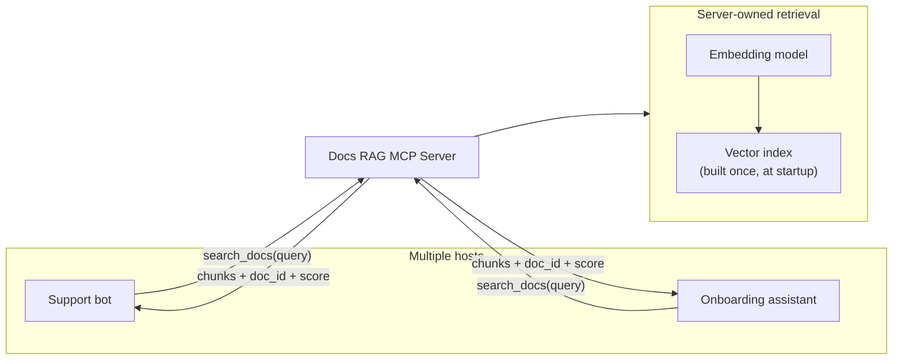
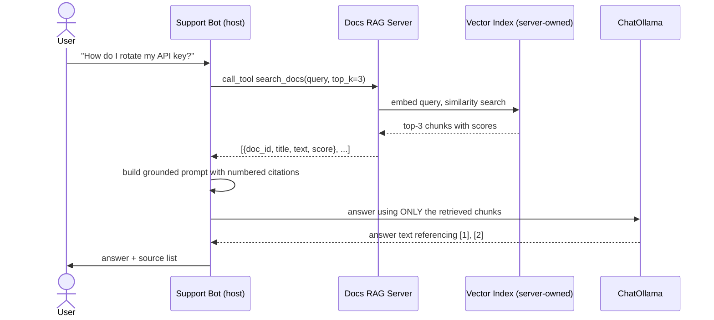

# Pattern 14: MCP with RAG

[← Back to index](./README.md)

## 1. Introduce the pattern

**MCP with RAG** means exposing retrieval — embedding a query and searching a vector index — as
an MCP **tool**, instead of embedding a vector-store client directly into every host that needs
grounded answers. The host calls `search_docs(query)` exactly like it would call any other tool;
it never touches an embedding model, a vector store SDK, or chunking logic at all. The retrieval
backend becomes centralized, reusable, and independently upgradable — the same shape of benefit
Pattern 3 (MCP Server) gave to a database connection pool, applied specifically to retrieval.



## 2. The problem it solves

Without this pattern, every host that wants grounded answers over the same documentation
duplicates the entire retrieval stack:

1. **Duplicated, drifting logic.** Each host picks its own embedding model, its own chunking
   strategy, its own similarity search code — the support bot and the onboarding assistant can
   end up giving *different* answers to the *same* question, sourced from *differently* chunked
   or *differently* embedded copies of the same documentation.
2. **Re-indexing is a multi-host problem.** When the docs team ships new content, every host with
   its own local index needs its own re-embedding job — miss one, and it silently serves stale
   answers.
3. **No consistent citation format.** Without one shared place that returns `doc_id` +
   `score` + source text together, every host invents its own (or skips) citation handling.

Centralizing retrieval behind one MCP tool means there's exactly **one** embedding model, **one**
index, and **one** citation contract — every host inherits improvements automatically.

## 3. A realistic production scenario

**Scenario: Product Documentation RAG Assistant.** The docs platform team owns the authoritative,
embedded index over the company's product documentation. Two separate hosts need grounded
answers from it: an external-facing **support bot** and an internal **onboarding assistant** for
new engineers. Both:

- Call the *same* `search_docs(query, top_k)` tool — no separate embedding pipeline in either
  host.
- Get back chunks with enough metadata (`doc_id`, `title`, `text`, `score`) to build a properly
  cited answer.
- Automatically benefit the moment the docs team improves the underlying index — no coordinated
  redeploy across both hosts required.

## 4. Architecture / flow diagram



## 5. The complete request-to-response flow

1. **Index built once, server-side.** At server startup, every documentation chunk is embedded a
   single time (via the same lifespan pattern from Pattern 3) and stored in an in-memory vector
   index — this cost is paid once, centrally, not once per host.
2. **Tool call, not a vector-store call.** The host calls `search_docs(query, top_k=3)` exactly
   like any other MCP tool — it has no idea (and doesn't need to know) whether the server uses
   FAISS, a hosted vector DB, or a plain in-memory array.
3. **Server-side retrieval.** The server embeds the incoming query with the *same* embedding model
   used to build the index, runs a similarity search, and returns the top-k chunks along with
   `doc_id`, `title`, and a similarity `score`.
4. **Grounded prompt construction.** The host builds a prompt that presents each retrieved chunk
   as a **numbered, citable source**, and instructs the model to answer using only that
   information — the same discipline as Pattern 10's untrusted-content wrapping, but here framing
   the content as trusted, citable ground truth rather than untrusted data.
5. **Cited synthesis.** The LLM produces an answer that references sources by number (`[1]`,
   `[2]`); the host renders those alongside the actual `doc_id`s so a user can verify or dig
   deeper via the `doc://{doc_id}` resource (reusing the resource-template pattern from Pattern 4).
6. **Any host, same answer quality.** Because the onboarding assistant calls the identical tool,
   it produces answers grounded in the identical index — no drift between the two surfaces.

## 6. Why this pattern is appropriate

- **One index, many consumers.** Exactly the same benefit Pattern 3 gave a shared DB pool, applied
  to retrieval: the docs team owns and improves one system, and every host benefits immediately.
- **Consistent grounding and citation.** Because the chunk-and-score contract is defined once, on
  the server, every host that uses it produces answers that are equally traceable back to source
  documents.
- **Decoupled upgrade path.** The docs team can swap embedding models, re-chunk documents, or move
  from an in-memory index to a production vector database — none of it requires any host-side
  code changes, since the tool's contract (`query` in, scored chunks out) doesn't change.

Trade-off: centralizing retrieval behind a network call adds latency compared to an in-process
vector store lookup — for a single host with no sharing need and extreme latency sensitivity, a
local retrieval library might still be simpler. This pattern earns its keep the moment more than
one consumer needs the same grounded knowledge, which is the common case in practice.

## 7. Production-quality implementation

### 7.1 Install dependencies

```bash
pip install "mcp[cli]>=1.28,<2" "langchain-ollama>=0.3" numpy
ollama pull llama3.1
ollama pull nomic-embed-text
```

### 7.2 The server — `docs_rag_server.py`

```python
"""
docs_rag_server.py

Owns the authoritative documentation index: embeds every chunk once at
startup (via lifespan), and exposes retrieval as a single search_docs tool
plus a doc://{doc_id} resource for citation drill-down.

Run:
    python docs_rag_server.py
"""

from __future__ import annotations

import contextlib
import logging
from collections.abc import AsyncIterator
from dataclasses import dataclass

import numpy as np
from pydantic import BaseModel

from langchain_ollama import OllamaEmbeddings
from mcp.server.fastmcp import Context, FastMCP
from mcp.server.session import ServerSession

logging.basicConfig(level=logging.INFO)
logger = logging.getLogger("docs_rag_server")


@dataclass(frozen=True)
class DocChunk:
    doc_id: str
    title: str
    text: str


_CHUNKS: list[DocChunk] = [
    DocChunk("doc-api-keys", "API Key Management",
             "To rotate an API key, go to Settings > API Keys, click Rotate next to the "
             "active key, and update any services using the old key within 24 hours."),
    DocChunk("doc-rate-limits", "Rate Limits",
             "The API allows 1000 requests per minute per key. Exceeding this returns a "
             "429 status; back off using the Retry-After header."),
    DocChunk("doc-webhooks", "Webhooks",
             "Webhook payloads are signed with HMAC-SHA256 using your webhook secret, "
             "found under Settings > Webhooks. Verify the signature before trusting a payload."),
]


@dataclass
class AppContext:
    embeddings: OllamaEmbeddings
    vectors: np.ndarray  # normalized, shape (n_chunks, dim)


@contextlib.asynccontextmanager
async def app_lifespan(server: FastMCP) -> AsyncIterator[AppContext]:
    """Build the vector index once, at startup — not per request."""
    embeddings = OllamaEmbeddings(model="nomic-embed-text")
    texts = [f"{c.title}: {c.text}" for c in _CHUNKS]
    raw = await embeddings.aembed_documents(texts)
    vectors = np.array(raw, dtype=np.float32)
    vectors /= np.linalg.norm(vectors, axis=1, keepdims=True)
    logger.info("Indexed %d documentation chunks", len(_CHUNKS))
    yield AppContext(embeddings=embeddings, vectors=vectors)


mcp = FastMCP(
    name="docs-rag-server",
    instructions="Search product documentation with search_docs before answering questions about it.",
    lifespan=app_lifespan,
)


class RetrievedChunk(BaseModel):
    doc_id: str
    title: str
    text: str
    score: float


@mcp.tool()
async def search_docs(
    query: str, ctx: Context[ServerSession, AppContext], top_k: int = 3
) -> list[RetrievedChunk]:
    """Search product documentation and return the top-k most relevant chunks, scored."""
    app_ctx = ctx.request_context.lifespan_context
    query_vec = np.array(await app_ctx.embeddings.aembed_query(query), dtype=np.float32)
    query_vec /= np.linalg.norm(query_vec)

    scores = app_ctx.vectors @ query_vec
    top_indices = np.argsort(-scores)[:top_k]

    return [
        RetrievedChunk(
            doc_id=_CHUNKS[i].doc_id,
            title=_CHUNKS[i].title,
            text=_CHUNKS[i].text,
            score=float(scores[i]),
        )
        for i in top_indices
    ]


@mcp.resource("doc://{doc_id}")
def read_doc(doc_id: str) -> str:
    """Read a documentation chunk's full text by id, for citation drill-down."""
    for chunk in _CHUNKS:
        if chunk.doc_id == doc_id:
            return f"# {chunk.title}\n\n{chunk.text}"
    return f"No document found with id '{doc_id}'."


if __name__ == "__main__":
    mcp.run(transport="stdio")
```

### 7.3 A host that answers with citations — `support_bot.py`

```python
"""
support_bot.py

Calls the shared docs RAG server exactly like any other MCP tool, then
builds a grounded, citable prompt from the returned chunks. A second host
(e.g. an onboarding assistant) could reuse this exact pattern against the
exact same server and get consistently grounded answers.

Run:
    python support_bot.py
"""

from __future__ import annotations

import asyncio

from langchain_ollama import ChatOllama
from mcp import ClientSession, StdioServerParameters
from mcp.client.stdio import stdio_client


async def answer_with_citations(session: ClientSession, model: ChatOllama, question: str) -> str:
    result = await session.call_tool("search_docs", {"query": question, "top_k": 3})
    chunks = result.structuredContent["result"]

    numbered_sources = "\n\n".join(
        f"[{i + 1}] ({c['doc_id']}) {c['title']}:\n{c['text']}" for i, c in enumerate(chunks)
    )

    prompt = (
        "Answer the user's question using ONLY the numbered sources below. "
        "Cite sources inline like [1], [2]. If the sources don't cover the "
        "question, say so rather than guessing.\n\n"
        f"Sources:\n{numbered_sources}\n\n"
        f"Question: {question}"
    )

    response = await model.ainvoke(prompt)
    citation_list = "\n".join(f"[{i + 1}] {c['doc_id']}" for i, c in enumerate(chunks))
    return f"{response.content}\n\nSources:\n{citation_list}"


async def main() -> None:
    server_params = StdioServerParameters(command="python", args=["docs_rag_server.py"])
    model = ChatOllama(model="llama3.1", temperature=0)

    async with stdio_client(server_params) as (read, write):
        async with ClientSession(read, write) as session:
            await session.initialize()
            answer = await answer_with_citations(
                session, model, "How do I rotate my API key safely?"
            )
            print(answer)


if __name__ == "__main__":
    asyncio.run(main())
```

### 7.4 What happens when you run it

1. `search_docs` returns the `doc-api-keys` chunk as the top hit for "how do I rotate my API key
   safely?" — with a materially higher score than the rate-limits or webhooks chunks.
2. The prompt sent to the model presents that chunk as source `[1]`, explicitly instructed to be
   the *only* basis for the answer — the model isn't free to answer from general training
   knowledge about API key rotation practices that might not match this product's actual UI flow.
3. The final answer cites `[1]`, and the printed source list maps that back to `doc-api-keys` — a
   user (or a support agent supervising the bot) can open `doc://doc-api-keys` directly to verify.
4. If the onboarding assistant asked the exact same question against the exact same server, it
   would retrieve the exact same chunk and produce an equivalently grounded, equivalently cited
   answer — there's no drift between the two hosts, because there's only one retrieval system
   behind both of them.

Next up: **MCP with Enterprise Systems** — connecting MCP to the messy reality of legacy internal
systems: SOAP APIs, mainframes, and systems that were never designed with an LLM (or even a REST
client) in mind.

---

[← Back to index](./README.md)
