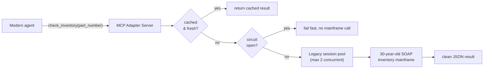
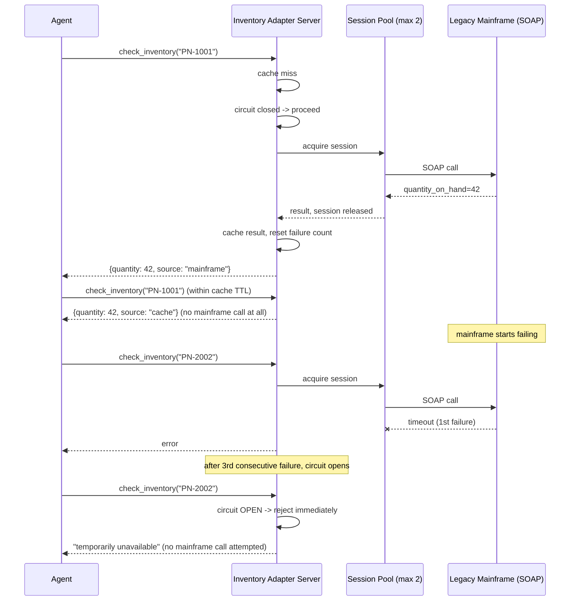

# Pattern 15: MCP with Enterprise Systems

[← Back to index](./README.md)

## 1. Introduce the pattern

**MCP with Enterprise Systems** is about using an MCP server as an **adapter** — sometimes called
an anti-corruption layer — in front of legacy systems that were never designed for modern API
consumption, let alone LLM tool-calling: SOAP services, mainframes with session-limited auth,
fixed-width file exports, systems that are simply *slow* and *occasionally down* by nature of
their age. The MCP server's job is to absorb all of that mess and present one clean, standard
tool contract — the caller never sees SOAP envelopes, session tokens, or retry logic.

Two concerns dominate this pattern that didn't show up in earlier ones:

- **Limited legacy capacity.** Many older systems support only a handful of concurrent sessions —
  flooding one with agent-driven traffic can degrade or take down a system other parts of the
  business still depend on.
- **Genuine unreliability.** Legacy systems fail more often, and more slowly, than modern
  services. A **circuit breaker** stops hammering a system that's already struggling, and a short
  **cache** absorbs repeat lookups without hitting it at all.



## 2. The problem it solves

A manufacturing company's inventory system runs on a 30-year-old mainframe, reachable only via a
SOAP API that: allows at most **2 concurrent sessions**, takes nearly a second per call even when
healthy, and occasionally goes fully unresponsive for a few minutes at a time. Without an adapter:

1. **Every host would need its own SOAP client, session management, and retry logic** — a
   maintenance burden multiplied by however many hosts need inventory data.
2. **Uncoordinated concurrent access could exceed the 2-session limit**, causing legitimate
   business processes (that also depend on this mainframe) to start failing.
3. **A struggling mainframe would just get hammered harder** by retrying agents, making a bad
   situation worse instead of backing off.

An MCP adapter server centralizes session management (so the 2-session limit is respected
regardless of how many hosts or agents are asking), adds a circuit breaker (so a struggling
mainframe gets a break instead of a pile-on), and caches recent results (so repeat lookups for the
same part don't need a fresh mainframe round-trip at all).

## 3. A realistic production scenario

**Scenario: Legacy Mainframe Inventory Adapter.** The mainframe's real interface is a slow,
session-limited SOAP API (in production, accessed via a library like `zeep`; simulated here with
a stand-in async function so the example runs without real SOAP infrastructure). The adapter
exposes one tool, `check_inventory(part_number)`, and internally:

- Serves from a short-lived cache when possible, avoiding a mainframe call entirely.
- Acquires one of at most 2 concurrent "legacy sessions" via a pool, respecting the mainframe's
  real capacity limit no matter how many requests arrive at once.
- Tracks consecutive failures with a circuit breaker; after 3 in a row, it stops attempting calls
  for a cooldown period and fails fast instead, protecting the mainframe from a retry storm.

## 4. Architecture / flow diagram



## 5. The complete request-to-response flow

1. **Cache check first.** Every call checks a short-TTL in-memory cache before anything else — a
   cache hit returns instantly with zero load on the mainframe.
2. **Circuit breaker check.** On a cache miss, the adapter checks whether the circuit is open
   (i.e. recent consecutive failures exceeded the threshold and the cooldown hasn't elapsed yet).
   If open, the call fails immediately and honestly — no attempt is made, protecting the mainframe.
3. **Session pool acquisition.** If the circuit is closed, the adapter acquires one of the pool's
   limited legacy sessions — if both are in use, the request waits, but never exceeds the
   mainframe's real concurrency limit.
4. **The actual legacy call.** The (simulated) SOAP call runs using the acquired session.
5. **Outcome recorded.** Success resets the failure counter and populates the cache; failure
   increments the counter and, past the threshold, opens the circuit.
6. **Clean result either way.** Whether served from cache, freshly from the mainframe, or rejected
   by the breaker, the caller always sees the same simple JSON shape and a `source` field — never
   a SOAP fault or a raw connection error.

## 6. Why this pattern is appropriate

- **Protects a shared, fragile resource.** The session pool and circuit breaker exist specifically
  to keep AI-agent traffic from becoming the thing that takes down a system other business
  processes still depend on.
- **Absorbs legacy latency and unreliability centrally.** Every host gets fast, resilient behavior
  "for free," without reimplementing caching or backoff logic itself.
- **Clean modern contract over a genuinely ugly backend.** The gap between "30-year-old SOAP
  mainframe" and "a tool an LLM can call reliably" is entirely the adapter's job — no other part
  of the system needs to know the mainframe exists at all.

Trade-off: the cache introduces a bounded staleness window (here, 10 seconds) — acceptable for
inventory counts that don't need millisecond freshness, not acceptable for something like a
real-time balance check. Tune (or drop) the cache TTL based on how stale an answer is actually
allowed to be for the specific legacy system in question.

## 7. Production-quality implementation

### 7.1 Install dependencies

```bash
pip install "mcp[cli]>=1.28,<2"
# In a real deployment, add a SOAP client for the actual legacy service, e.g.:
# pip install zeep
```

### 7.2 A stand-in for the real legacy SOAP service — `legacy_mainframe_stub.py`

```python
"""
legacy_mainframe_stub.py

Stands in for a real zeep-based SOAP client talking to the AS/400 inventory
system, so this example runs without real legacy infrastructure. In
production, soap_check_inventory would use zeep to call the actual WSDL
endpoint, and session_token would be a real mainframe session credential.
"""

from __future__ import annotations

import asyncio

_FAILURE_MODE = {"enabled": False}
_INVENTORY: dict[str, int] = {"PN-1001": 42, "PN-2002": 0}


async def soap_check_inventory(session_token: str, part_number: str) -> dict[str, object]:
    """Simulated slow, occasionally-failing legacy SOAP call."""
    await asyncio.sleep(0.5)  # legacy systems are slow even when healthy
    if _FAILURE_MODE["enabled"]:
        raise ConnectionError("mainframe SOAP gateway timeout")
    if part_number not in _INVENTORY:
        raise ValueError(f"Unknown part number '{part_number}'")
    return {
        "part_number": part_number,
        "quantity_on_hand": _INVENTORY[part_number],
        "session_used": session_token,
    }


def set_failure_mode(enabled: bool) -> None:
    """Test hook: simulate the mainframe going down / recovering."""
    _FAILURE_MODE["enabled"] = enabled
```

### 7.3 The adapter server — `mainframe_adapter_server.py`

```python
"""
mainframe_adapter_server.py

Adapter in front of a legacy, session-limited, occasionally-unreliable
mainframe system: caches recent results, limits concurrency to what the
mainframe can actually handle, and trips a circuit breaker under sustained
failure instead of retrying indefinitely.

Run:
    python mainframe_adapter_server.py
"""

from __future__ import annotations

import asyncio
import contextlib
import logging
import time
import uuid
from collections.abc import AsyncIterator
from dataclasses import dataclass, field

from mcp.server.fastmcp import Context, FastMCP
from mcp.server.session import ServerSession

from legacy_mainframe_stub import set_failure_mode, soap_check_inventory

logging.basicConfig(level=logging.INFO)
logger = logging.getLogger("mainframe_adapter_server")

CACHE_TTL_SECONDS = 10.0
CIRCUIT_FAILURE_THRESHOLD = 3
CIRCUIT_COOLDOWN_SECONDS = 8.0
MAX_CONCURRENT_LEGACY_SESSIONS = 2

_cache: dict[str, tuple[float, dict]] = {}


def _cache_get(part_number: str) -> dict | None:
    entry = _cache.get(part_number)
    if entry is None:
        return None
    ts, value = entry
    if time.monotonic() - ts > CACHE_TTL_SECONDS:
        return None
    return value


def _cache_set(part_number: str, value: dict) -> None:
    _cache[part_number] = (time.monotonic(), value)


class CircuitBreaker:
    """Closed -> Open after N consecutive failures -> half-open trial after cooldown."""

    def __init__(self, failure_threshold: int, cooldown_seconds: float) -> None:
        self._failure_threshold = failure_threshold
        self._cooldown_seconds = cooldown_seconds
        self._failure_count = 0
        self._opened_at: float | None = None

    @property
    def is_open(self) -> bool:
        if self._opened_at is None:
            return False
        if time.monotonic() - self._opened_at >= self._cooldown_seconds:
            return False  # cooldown elapsed: allow a trial call through
        return True

    def record_success(self) -> None:
        self._failure_count = 0
        self._opened_at = None

    def record_failure(self) -> None:
        self._failure_count += 1
        if self._failure_count >= self._failure_threshold:
            self._opened_at = time.monotonic()
            logger.warning("circuit breaker OPEN after %d consecutive failures", self._failure_count)


class LegacySessionPool:
    """Respects the mainframe's real concurrent-session limit."""

    def __init__(self, max_sessions: int) -> None:
        self._semaphore = asyncio.Semaphore(max_sessions)

    @contextlib.asynccontextmanager
    async def session(self) -> AsyncIterator[str]:
        async with self._semaphore:
            token = f"sess-{uuid.uuid4().hex[:8]}"
            try:
                yield token
            finally:
                pass  # in production: release/close the real legacy session here


@dataclass
class AdapterContext:
    pool: LegacySessionPool
    breaker: CircuitBreaker


@contextlib.asynccontextmanager
async def app_lifespan(server: FastMCP) -> AsyncIterator[AdapterContext]:
    yield AdapterContext(
        pool=LegacySessionPool(MAX_CONCURRENT_LEGACY_SESSIONS),
        breaker=CircuitBreaker(CIRCUIT_FAILURE_THRESHOLD, CIRCUIT_COOLDOWN_SECONDS),
    )


mcp = FastMCP(
    name="mainframe-inventory-adapter",
    instructions="Check on-hand inventory from the legacy mainframe system.",
    lifespan=app_lifespan,
)


@mcp.tool()
async def check_inventory(
    part_number: str, ctx: Context[ServerSession, AdapterContext]
) -> dict[str, object]:
    """Check on-hand inventory quantity for a part number."""
    cached = _cache_get(part_number)
    if cached is not None:
        logger.info("cache hit for %s", part_number)
        return {**cached, "source": "cache"}

    app_ctx = ctx.request_context.lifespan_context
    if app_ctx.breaker.is_open:
        raise RuntimeError(
            "Inventory system is temporarily unavailable (circuit open); try again shortly"
        )

    try:
        async with app_ctx.pool.session() as token:
            result = await soap_check_inventory(token, part_number)
    except Exception:
        app_ctx.breaker.record_failure()
        raise
    else:
        app_ctx.breaker.record_success()
        _cache_set(part_number, result)
        return {**result, "source": "mainframe"}


@mcp.tool()
async def _simulate_mainframe_outage(enabled: bool) -> dict[str, str]:
    """Test-only hook: toggles simulated mainframe failures. Not exposed in production."""
    set_failure_mode(enabled)
    return {"failure_mode": str(enabled)}


if __name__ == "__main__":
    mcp.run(transport="stdio")
```

### 7.4 A client exercising the cache, pool, and breaker — `adapter_client.py`

```python
"""
adapter_client.py

Demonstrates all three resilience layers: a cache hit, a circuit trip after
repeated legacy failures, and fast-fail rejection while the circuit is open.
"""

from __future__ import annotations

import asyncio

from mcp import ClientSession, StdioServerParameters
from mcp.client.stdio import stdio_client


async def main() -> None:
    server_params = StdioServerParameters(command="python", args=["mainframe_adapter_server.py"])

    async with stdio_client(server_params) as (read, write):
        async with ClientSession(read, write) as session:
            await session.initialize()

            first = await session.call_tool("check_inventory", {"part_number": "PN-1001"})
            print("First call (mainframe):", first.structuredContent)

            second = await session.call_tool("check_inventory", {"part_number": "PN-1001"})
            print("Second call (cached):", second.structuredContent)

            await session.call_tool("_simulate_mainframe_outage", {"enabled": True})
            print("\n--- mainframe outage simulated ---")

            for i in range(4):
                result = await session.call_tool("check_inventory", {"part_number": "PN-2002"})
                label = "rejected (circuit open)" if result.isError else "unexpected success"
                print(f"call {i + 1} during outage: {label}")

            await session.call_tool("_simulate_mainframe_outage", {"enabled": False})
            await asyncio.sleep(8.5)  # wait out the cooldown

            recovered = await session.call_tool("check_inventory", {"part_number": "PN-2002"})
            print("\nAfter cooldown + recovery:", recovered.structuredContent)


if __name__ == "__main__":
    asyncio.run(main())
```

### 7.5 What happens when you run it

1. The first `PN-1001` lookup takes ~500ms (the simulated SOAP call); the second, within the
   10-second cache window, returns instantly with `source: "cache"` — no mainframe call at all.
2. Once the simulated outage starts, the first three `PN-2002` calls each attempt (and fail) a
   real mainframe call; the third failure trips the breaker.
3. The fourth call is rejected **immediately**, without attempting the mainframe at all — exactly
   the fail-fast behavior that protects a struggling legacy system from a pile-on.
4. After the outage is turned off and the 8-second cooldown elapses, the next call is allowed
   through as a trial (`is_open` returns `False` once the cooldown passes) and succeeds, resetting
   the breaker back to closed.

Next up: **Multi-MCP Architecture** — the capstone pattern, combining everything from this series
into one coherent system spanning many servers, many hosts, and every resilience and governance
concern covered so far.

---

[← Back to index](./README.md)
