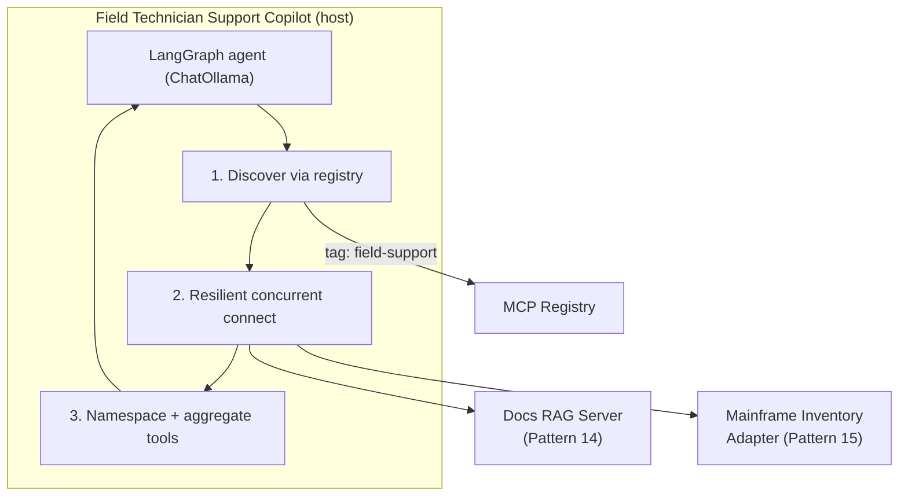
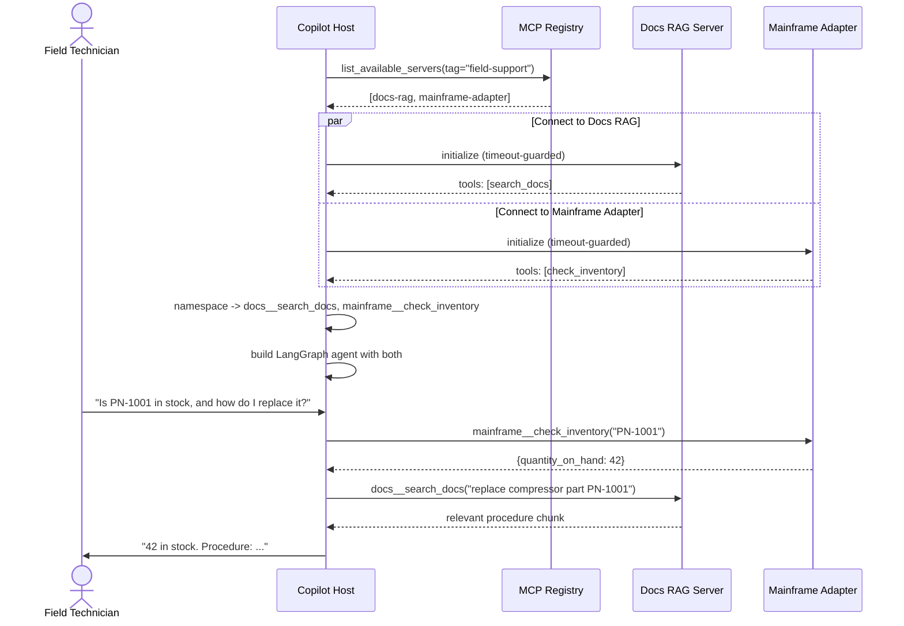

# Pattern 16: Multi-MCP Architecture

[← Back to index](./README.md)

## 1. Introduce the pattern

This is the capstone. Every real production AI platform ends up looking like this pattern: **one
host, talking to many independently-owned, heterogeneous MCP servers at once** — a registry for
discovery, a RAG server for grounded knowledge, a legacy-system adapter, a CRM, and more — with
every concern from this series operating simultaneously rather than in isolation:

- **Discovery** (Pattern 7) so the host doesn't hardcode every server it might need.
- **Resilient connection** (Pattern 2) so one server being down doesn't take the whole assistant
  down.
- **Namespaced, discoverable tools** (Patterns 8–9) so many servers' tools coexist safely and
  update live.
- **Security and authorization** (Patterns 10–11) so every server enforces its own trust boundary.
- **Routing** (Pattern 12) where more than one server could equivalently serve a request.
- **Multi-step orchestration, RAG, and legacy adapters** (Patterns 13–15) as the actual servers
  and workflows doing the real work.

Multi-MCP Architecture isn't a new technique so much as it's what happens when you stop looking at
these patterns one at a time and see them running together, in one system, for real.



## 2. The problem it solves

No single earlier pattern is sufficient on its own for a real deployment:

- Discovery alone (Pattern 7) doesn't help if a discovered server is temporarily unreachable —
  you still need Pattern 2's per-server resilience.
- Resilience alone doesn't prevent tool name collisions once you're connected to several servers
  at once — you still need Pattern 8's namespacing.
- None of the data-access patterns (RAG, enterprise adapters) say anything about *how a host finds
  and safely connects to* the servers implementing them in the first place.

Multi-MCP Architecture is what you get when all of these operate together, continuously, in one
running system — not a new mechanism, but the honest shape of "what does it take to actually ship
this."

## 3. A realistic production scenario

**Scenario: Field Technician Support Copilot.** A technician in the field asks: *"I need to
replace part PN-1001 on this compressor — is it in stock, and what's the replacement procedure?"*
Answering this single question genuinely requires **two different backend systems**:

1. **Inventory** — from the legacy mainframe adapter (Pattern 15): is PN-1001 in stock?
2. **Repair documentation** — from the docs RAG server (Pattern 14): what's the replacement
   procedure?

The host doesn't hardcode either server's address — it discovers both through the registry
(Pattern 7), tagged `"field-support"`, connects to both resiliently (Pattern 2), and merges their
tools into one namespaced toolset (Pattern 8) for a single LangGraph agent to reason over.

## 4. Architecture / flow diagram



## 5. The complete request-to-response flow

1. **Discover.** The host queries the registry for servers tagged `"field-support"` — today that's
   two servers; a third could be added next month with zero host code changes.
2. **Connect resiliently, concurrently.** Both servers are connected to in parallel, each with its
   own timeout and fallback — if the mainframe adapter is briefly unreachable, the copilot still
   works for documentation-only questions instead of failing the whole conversation.
3. **Namespace and aggregate.** Tools from both servers are merged into one list under
   `{server}__{tool}` names, so `docs__search_docs` and `mainframe__check_inventory` can never
   collide with each other or with a third server added later.
4. **Single agent, multiple backends.** One LangGraph ReAct agent is built with the combined
   toolset — it doesn't know or care that its two tools come from an embeddings-based RAG server
   and a circuit-breaker-protected legacy adapter respectively.
5. **Composite reasoning.** For the technician's question, the model recognizes it needs *both*
   pieces of information, calls both tools (in whichever order it determines makes sense), and
   synthesizes a single answer combining a live inventory count with a documentation-grounded
   procedure.
6. **Every underlying concern still applies, invisibly.** The RAG server still does its
   citation-shaped retrieval (Pattern 14); the mainframe adapter still enforces its cache and
   circuit breaker (Pattern 15); if either server required OAuth (Pattern 11), that would be
   handled during the connect step, transparently to the agent.

## 6. Why this pattern is appropriate

- **This is simply what production looks like.** No real assistant talks to exactly one server for
  exactly one purpose forever — capability grows, and each new capability is another server, not
  a rewrite of the host.
- **Composability was the point all along.** Every earlier pattern in this series was designed to
  be a small, independent unit specifically so they *would* combine cleanly here — discovery
  doesn't need to know about namespacing; namespacing doesn't need to know about circuit breakers;
  each layer does its one job.
- **Failure isolation compounds.** A single fragile legacy system (Pattern 15) can be having a bad
  day without degrading the RAG-backed documentation search at all — resilience patterns applied
  per-server add up to a genuinely robust whole system.

**A field guide — which pattern to reach for:**

| Need | Pattern |
|---|---|
| Learn MCP's basic shape | 1 — MCP Fundamentals |
| Handle multiple servers/transports reliably | 2 — MCP Client |
| Serve data/actions at scale, own the resource lifecycle | 3 — MCP Server |
| Expose read-only, cacheable, subscribable data | 4 — MCP Resources |
| Expose model-invoked actions safely | 5 — MCP Tools |
| Share reusable, user-triggered templates | 6 — MCP Prompts |
| Design the org-wide shape of "what talks to what" | 7 — MCP Architecture |
| Keep tool lists relevant and collision-free | 8 — Tool Discovery |
| React to capabilities changing at runtime | 9 — Dynamic Tool Discovery |
| Defend against injection and unsafe input/output | 10 — MCP Security |
| Enforce identity and scopes over HTTP | 11 — MCP Authorization |
| Choose between equivalent servers deterministically | 12 — MCP Tool Routing |
| Combine deterministic steps and LLM judgment | 13 — MCP with Agents |
| Centralize grounded retrieval for many hosts | 14 — MCP with RAG |
| Wrap a fragile legacy system safely | 15 — MCP with Enterprise Systems |
| Run all of the above together, for real | 16 — Multi-MCP Architecture (this one) |

## 7. Production-quality implementation

### 7.1 Install dependencies

```bash
pip install "mcp[cli]>=1.28,<2" "langchain-mcp-adapters>=0.2" \
            "langgraph>=1.2" "langchain-ollama>=0.3" numpy
ollama pull llama3.1
ollama pull nomic-embed-text
```

### 7.2 Condensed registry — `field_registry_server.py`

```python
"""
field_registry_server.py

Condensed registry (see Pattern 7 for the full version) listing the two
servers this capstone composes.
"""
from mcp.server.fastmcp import FastMCP

mcp = FastMCP(name="field-registry")

_CATALOGUE = [
    {"name": "docs-rag", "command": "python", "args": ["field_docs_rag_server.py"],
     "transport": "stdio", "tags": ["field-support"]},
    {"name": "mainframe-adapter", "command": "python", "args": ["field_mainframe_server.py"],
     "transport": "stdio", "tags": ["field-support"]},
]


@mcp.tool()
def list_available_servers(tag: str | None = None) -> list[dict]:
    """List approved MCP servers, optionally filtered by tag."""
    return [e for e in _CATALOGUE if tag is None or tag in e["tags"]]


if __name__ == "__main__":
    mcp.run(transport="stdio")
```

### 7.3 Condensed docs RAG server — `field_docs_rag_server.py`

```python
"""
field_docs_rag_server.py

Condensed RAG server (see Pattern 14 for the full lifespan-managed version).
"""
from __future__ import annotations

import numpy as np
from langchain_ollama import OllamaEmbeddings
from mcp.server.fastmcp import FastMCP

mcp = FastMCP(name="docs-rag")

_CHUNKS = [
    {"id": "proc-compressor-part", "text": "To replace PN-1001 on a compressor: power down, "
     "release residual pressure, unbolt the housing, swap the part, and torque bolts to 35 Nm."},
    {"id": "proc-filter", "text": "To replace an air filter: open the intake cover and slide "
     "the filter out; no tools required."},
]
_embeddings = OllamaEmbeddings(model="nomic-embed-text")
_vectors: np.ndarray | None = None


async def _ensure_index() -> None:
    global _vectors
    if _vectors is None:
        raw = await _embeddings.aembed_documents([c["text"] for c in _CHUNKS])
        _vectors = np.array(raw, dtype=np.float32)
        _vectors /= np.linalg.norm(_vectors, axis=1, keepdims=True)


@mcp.tool()
async def search_docs(query: str, top_k: int = 1) -> list[dict]:
    """Search repair documentation for a relevant procedure."""
    await _ensure_index()
    q = np.array(await _embeddings.aembed_query(query), dtype=np.float32)
    q /= np.linalg.norm(q)
    scores = _vectors @ q
    top = np.argsort(-scores)[:top_k]
    return [{"id": _CHUNKS[i]["id"], "text": _CHUNKS[i]["text"]} for i in top]


if __name__ == "__main__":
    mcp.run(transport="stdio")
```

### 7.4 Condensed mainframe adapter — `field_mainframe_server.py`

```python
"""
field_mainframe_server.py

Condensed adapter (see Pattern 15 for the full cache/circuit-breaker/session-pool version).
"""
from mcp.server.fastmcp import FastMCP

mcp = FastMCP(name="mainframe-adapter")

_INVENTORY = {"PN-1001": 42, "PN-2002": 0}


@mcp.tool()
def check_inventory(part_number: str) -> dict:
    """Check on-hand inventory for a part number."""
    if part_number not in _INVENTORY:
        return {"error": f"Unknown part '{part_number}'"}
    return {"part_number": part_number, "quantity_on_hand": _INVENTORY[part_number]}


if __name__ == "__main__":
    mcp.run(transport="stdio")
```

### 7.5 The capstone host — `field_copilot.py`

```python
"""
field_copilot.py

Ties Patterns 2, 7, and 8 together: discovers servers via the registry,
connects to each resiliently and concurrently, namespaces and merges their
tools, and answers a composite question using a single LangGraph agent
spanning both a RAG server and a legacy-system adapter.

Run:
    python field_copilot.py
"""

from __future__ import annotations

import asyncio
import logging

from langchain_core.tools import BaseTool
from langchain_mcp_adapters.client import MultiServerMCPClient
from langchain_ollama import ChatOllama
from langgraph.prebuilt import create_react_agent
from mcp import ClientSession, StdioServerParameters
from mcp.client.stdio import stdio_client

logging.basicConfig(level=logging.INFO)
logger = logging.getLogger("field_copilot")

CONNECT_TIMEOUT_SECONDS = 5.0


async def discover_servers(tag: str) -> list[dict]:
    """Pattern 7: ask the registry which servers are approved for this need."""
    params = StdioServerParameters(command="python", args=["field_registry_server.py"])
    async with stdio_client(params) as (read, write):
        async with ClientSession(read, write) as session:
            await session.initialize()
            result = await session.call_tool("list_available_servers", {"tag": tag})
            return result.structuredContent["result"]


def _namespace_tool(server_name: str, tool: BaseTool) -> BaseTool:
    """Pattern 8: prevent collisions across independently-built servers."""
    return tool.model_copy(update={"name": f"{server_name}__{tool.name}"})


async def _get_tools_with_fallback(
    client: MultiServerMCPClient, server_name: str
) -> list[BaseTool]:
    """Pattern 2: one server's failure never sinks the whole copilot."""
    try:
        tools = await asyncio.wait_for(
            client.get_tools(server_name=server_name), timeout=CONNECT_TIMEOUT_SECONDS
        )
        return [_namespace_tool(server_name, t) for t in tools]
    except Exception as exc:
        logger.warning("server '%s' unavailable (%s); continuing without it", server_name, exc)
        return []


async def build_copilot_toolset() -> list[BaseTool]:
    entries = await discover_servers(tag="field-support")
    server_config = {
        e["name"]: {"command": e["command"], "args": e["args"], "transport": e["transport"]}
        for e in entries
    }
    logger.info("Discovered servers: %s", list(server_config))

    client = MultiServerMCPClient(server_config)
    per_server = await asyncio.gather(
        *(_get_tools_with_fallback(client, name) for name in server_config)
    )
    tools = [t for group in per_server for t in group]
    logger.info("Combined toolset: %s", [t.name for t in tools])
    return tools


async def main() -> None:
    tools = await build_copilot_toolset()
    if not tools:
        raise RuntimeError("No field-support servers reachable")

    model = ChatOllama(model="llama3.1", temperature=0)
    agent = create_react_agent(
        model,
        tools,
        prompt=(
            "You are a field technician support copilot. Use the available tools to check "
            "inventory and find repair procedures. Answer using both when a question needs it."
        ),
    )

    question = "I need to replace part PN-1001 on a compressor. Is it in stock, and how do I replace it?"
    result = await agent.ainvoke({"messages": [{"role": "user", "content": question}]})

    print("\n--- Field Copilot response ---")
    print(result["messages"][-1].content)


if __name__ == "__main__":
    asyncio.run(main())
```

### 7.6 What happens when you run it

1. `discover_servers("field-support")` returns both `docs-rag` and `mainframe-adapter` — the host
   never hardcoded either's launch command directly; it learned them from the registry.
2. Both servers are connected to concurrently with independent timeouts; if either were down, the
   copilot would still start with whatever tools remain available, degraded but functional.
3. The combined toolset is `["docs-rag__search_docs", "mainframe-adapter__check_inventory"]` —
   namespaced, so a third server added to the registry tomorrow (with, say, its own `search_docs`
   tool) could never collide with the RAG server's.
4. Given the composite question, the model calls **both** tools — `mainframe-adapter__check_inventory`
   for the stock count, `docs-rag__search_docs` for the replacement procedure — and produces one
   answer combining a live number from a legacy system with a grounded, cited procedure from a RAG
   index, entirely through the same generic tool-calling loop used since Pattern 1.

## Series complete

That's all 16 patterns — from the basic host/client/server handshake in Pattern 1 through the
full multi-server, multi-concern production system here in Pattern 16. Each file in this series
stands alone, but they're designed to compose exactly the way this capstone demonstrates: pick the
patterns your system actually needs, and layer them together the same way real MCP deployments do.

---

[← Back to index](./README.md)
